# HackFlow by Hackathon Raptors

[](LICENSE)
[](acceptance-report.txt)
[](api/requirements.txt)
[](api/requirements.txt)
[](web/package.json)
[](web/package.json)
[](docker-compose.yml)
[](docker-compose.yml)

A self-hosted, API-first hackathon operations platform that runs an event's whole life:
registration, teams, submissions, eligibility, judge assignment, weighted scoring, score
normalization, results, verifiable certificates and a searchable archive. Built for
[Hackathon Raptors](https://www.raptors.dev), who run a dozen events a year and asked, with
DOGFOOD 2026, for the platform they will run them on.

Built by Team CodeHawk against [`docs/PLAN.md`](docs/PLAN.md), the execution spec for this
build. HackFlow is a DOGFOOD entry, not an official Hackathon Raptors product; see
[`docs/CREDITS.md`](docs/CREDITS.md).

## For evaluators

**Claimed tiers: T1, T2, T3, T4.** The official checker verifies T1 and T2 (7 of 7 checks pass,
[`acceptance-report.txt`](acceptance-report.txt)); T3 and T4 are judged by hand.

```text
dog-food/
├── .dogfood.toml            ← where things are, and what we claim (T1-T4)
├── acceptance-report.txt    ← what run.py printed: 7/7, T1 and T2 verified
├── docker-compose.yml       ← one command to a seeded, working portal
├── .env.example             ← optional: real email and your public URL; not needed to run
├── README.md                ← this file: what it does, how to run it, honest limits
├── ARCHITECTURE.md          ← how it is put together, and why
├── DATA-MODEL.md            ← the schema, and the ways data gets in and out
├── JUDGING.md               ← assignment, weighted scoring, normalization, defended
├── LICENSE                  ← MIT
├── api/                     ← our backend: FastAPI + SQLModel, with api/tests/ (387 tests)
├── web/                     ← our frontend: React + TypeScript, with web/tests/ (114 browser tests)
├── docs/                    ← everything else: manual, threat model, credits, screenshots
├── fixtures.json, run.py    ← the organizers' dataset and checker, unchanged
└── fixtures/                ← our extra demo events, users and teams
```

Every document, and what it is for:

| Document | What you'll find |
|---|---|
| [README.md](README.md) | The ten-stage walkthrough with screenshots, quickstart, deploy, features, known limits, test status |
| [ARCHITECTURE.md](ARCHITECTURE.md) | System shape, the modular-monolith rationale, auth, storage, webhooks, testing |
| [DATA-MODEL.md](DATA-MODEL.md) | Every table and column, relationships, CSV exports, JSON import and export |
| [JUDGING.md](JUDGING.md) | Conflict-aware assignment, weighted rubrics, per-judge z-score normalization and why |
| [docs/THREAT-MODEL.md](docs/THREAT-MODEL.md) | 31 attacks (sybil votes, ballot stuffing, judge collusion, deadline gaming, leaked keys...), each with what stops it and the file that enforces it |
| [docs/USER-MANUAL.md](docs/USER-MANUAL.md) | Illustrated, plain-language guide for participants, judges, organizers and admins |
| [docs/CREDITS.md](docs/CREDITS.md) | Hackathon Raptors' details and posters, photo licences, third-party software, contributors |
| [docs/DESIGN_SYSTEM.md](docs/DESIGN_SYSTEM.md) | Design tokens and component rules the UI is built from |
| [docs/PLAN.md](docs/PLAN.md) | The execution spec, phase by phase, with every judgment call (`## Open Questions`) |

**Verify it in three commands:**

```bash
docker compose up --build        # seeded portal at http://localhost:8000, no .env needed
python run.py .dogfood.toml      # the official checker: 7/7
docker compose exec api pytest tests/ -q
```

**Fig. 02. Role isolation matrix.** What each caller gets back from the server, enforced by
`require_role()` plus ownership and track checks, never by the UI hiding a control.
"Other track" is a judge whose panel track differs from the entry's track (JUDGING.md,
assignment rule 8); "Other judge" is a judge the entry is not assigned to.

| Action | Anonymous | Participant | Assigned judge | Other track | Other judge | Organizer, admin |
|---|---|---|---|---|---|---|
| Browse the gallery | 200 | 200 | 200 | 200 | 200 | 200 |
| Open an entry's score sheet | 401 | 403 | 200 | 403 | 403 | 403 |
| Submit or read a score for it | 401 | 403 | 200 | 403 | 403 | 403 |
| See it on the judge dashboard | 401 | 403 | listed | not listed | not listed | 403 |
| Read your own scores | 401 | 403 | 200 | its score left out | 200 | 200 |
| Read another judge's scores | 401 | 403 | 403, audited | 403, audited | 403, audited | 200 |
| Normalised results, CSV exports | 401 | 403 | 403 | 403 | 403 | 200 |
| Set a judge's track, run assignment | 401 | 403 | 403 | 403 | 403 | 200 |

## From registration to archive: the ten stages

Every stage below is a screen in the running app, captured from `docker compose up` on the
seeded data (regenerate with `cd web && node scripts/readme-walkthrough.mjs`). Each stage
feeds the next, and each hands the next one data it can trust.

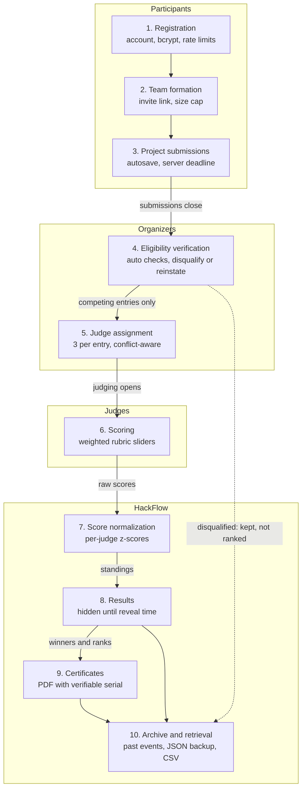

How to read it: each box is one stage, grouped by who does the work. The labels on the arrows
are the gates between stages, and the server enforces each one. A save after the deadline is
refused, so eligibility only ever sees final entries. Only competing entries get judges.
Judges only score what they were assigned. Normalization only sees raw rubric totals, and
results stay hidden until the reveal time. Certificates and the archive are built from those
revealed results. A disqualified entry drops out of judging and standings, but it is kept (the
dotted line), so an organizer can reinstate it and the record stays complete.

An event can also show its own **stages** (Stage 1: Registration, Stage 2: Build sprint, and so
on), the way Unstop shows a competition's rounds. The current stage is highlighted.

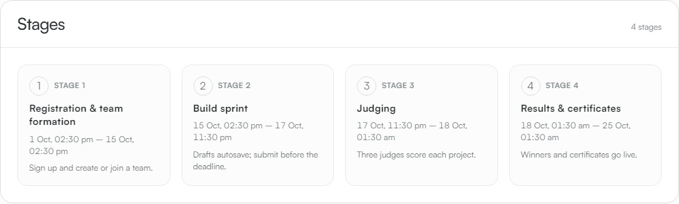

### 1. Registration
Anyone signs up with a name, email and password and becomes a **participant**. Judge,
organizer and admin roles are granted by invitation, never self-chosen, because they can see
scores. Passwords are bcrypt-hashed, sign-in is rate-limited per account and per IP, and email
verification is available when SMTP is set up.

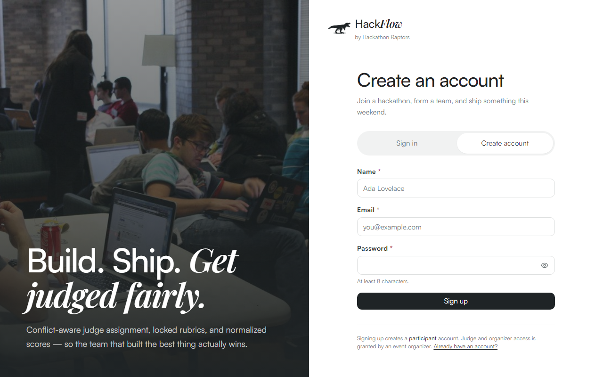

### 2. Team formation
A participant creates a team and shares its invite link, or joins through someone else's.
One team per person per event and the team-size cap are both enforced by the database and the
API. The captain renames the team, removes members, hands over captaincy and replaces the link.

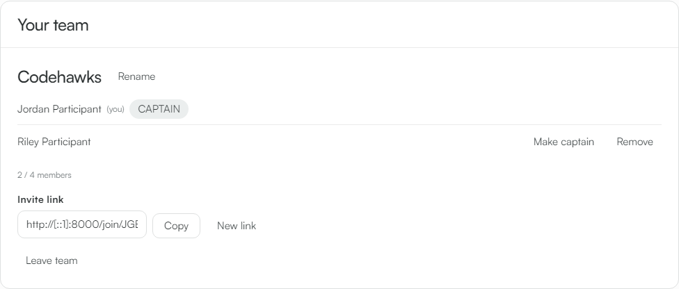

### 3. Project submissions
One submission per team, autosaving as you type, with code, demo and video links. The
deadline countdown is always on screen, and it is the same clock the server enforces: a save
after the deadline is refused by the API, not just hidden.

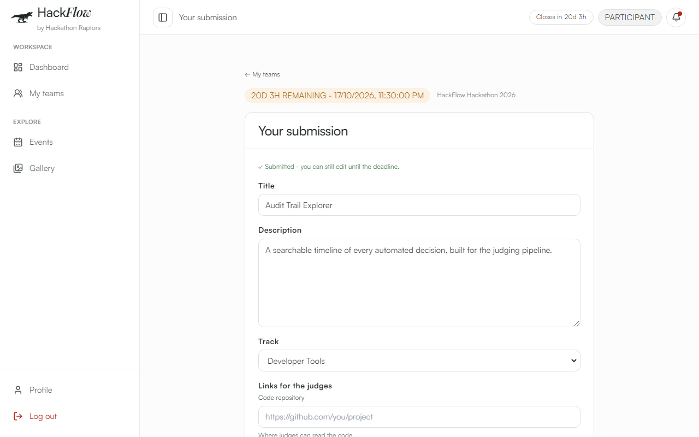

### 4. Eligibility verification
Every submitted entry is **checked automatically**: no repository link, the same repository
as another entry, a thin description, no track, or a team over the size cap. Checks only
flag; the organizer rules, with **Disqualify / Reinstate** and a reason the team sees. A
disqualified entry leaves the gallery, voting, judging and standings, and its scores are kept
for a reinstatement.

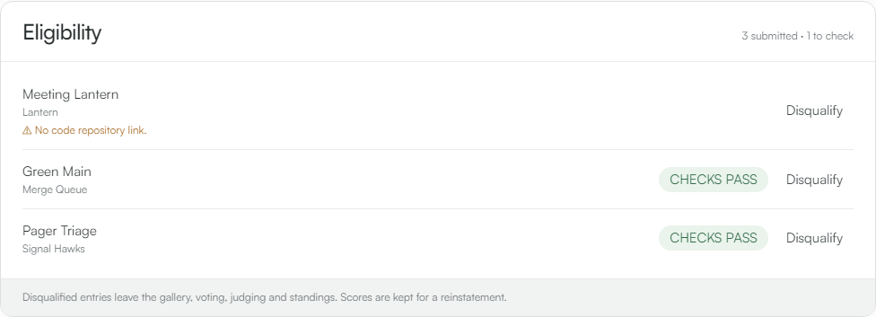

### 5. Judge assignment
Each event has its own judge panel. **Assign judges** gives every competing entry three judges,
spreads the load evenly, and never assigns a judge to their own team or to a project they
declared a conflict with. It is deterministic and re-running only fills gaps. Judging opens
only after submissions close, and progress shows who is behind.

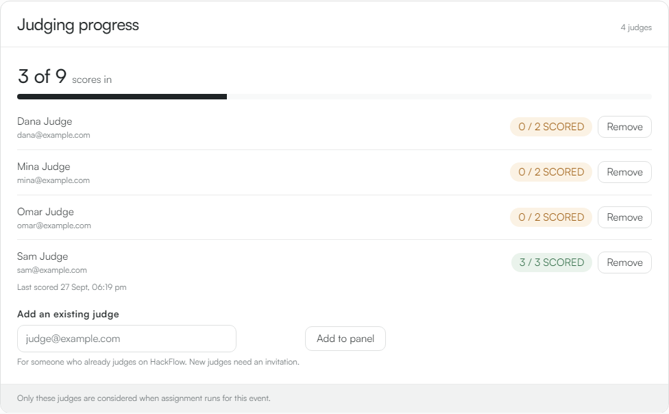

### 6. Scoring
Organizers build one or more **weighted rubrics** (e.g. Technical 70% + Presentation 30%),
locked once the first score exists. Judges score on sliders with a live weighted total, see
only their own scores, and can step back from a conflict. Role isolation is enforced in the
API: a judge asking for another judge's scores gets 403.

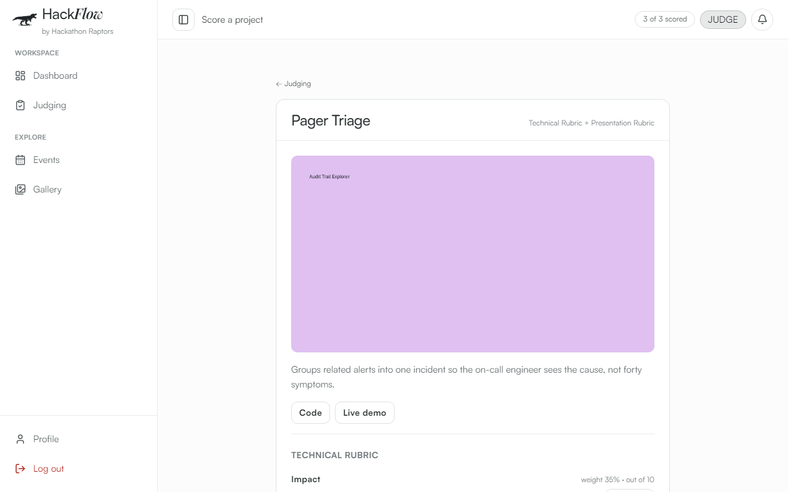

### 7. Score normalization
Judges mark differently: one gives everything 90, another is strict. HackFlow converts each
judge's totals to z-scores against **that judge's own** mean and spread, then averages them,
so a harsh or a generous judge can't move the ranking. A judge who gave everyone the same
score contributes no ranking information rather than dividing by zero. The maths, and why
it beats a plain average, is in [JUDGING.md](JUDGING.md).

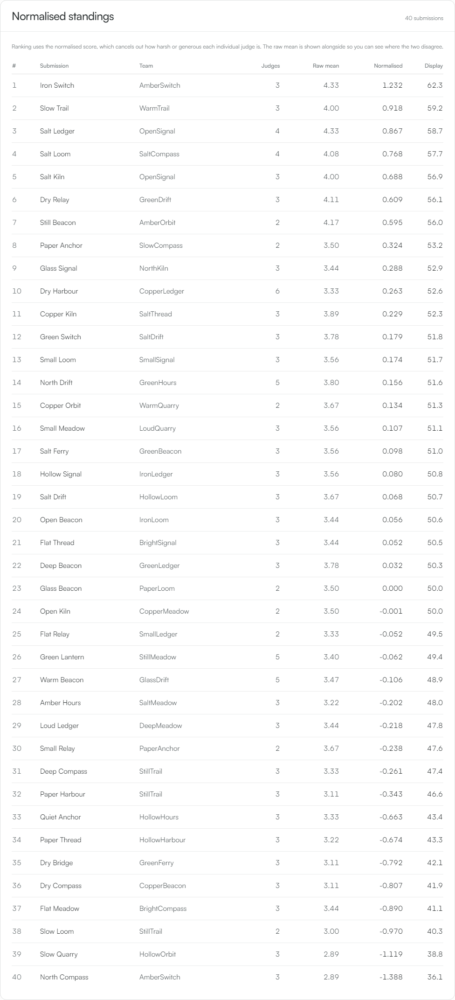

### 8. Results
Standings are hidden from everyone but organizers until the reveal time, enforced in the API
response itself. The organizer confirms a winner for each prize, starting from a suggestion
drawn from the standings, and winners go public at the reveal.

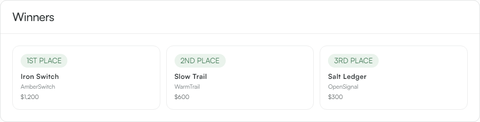

### 9. Certificates
Each team gets a PDF certificate, rendered on the server with no external service: members'
names, event and dates, project, prize and rank. Every certificate carries a serial that
anyone (an employer, a university) can check at `/verify` without an account.

| The certificate | Public verification |
|---|---|
| 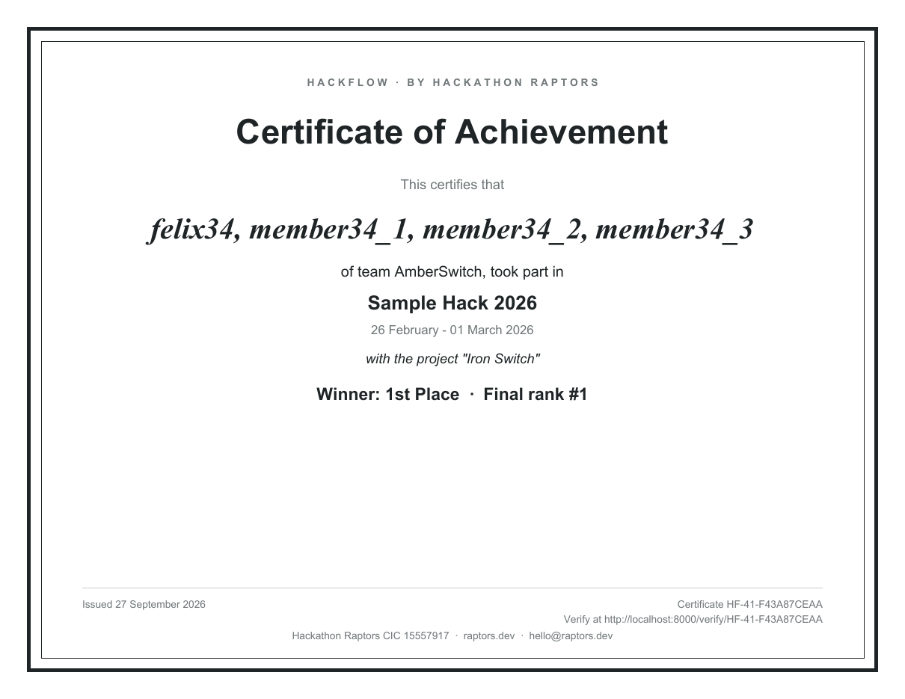 | 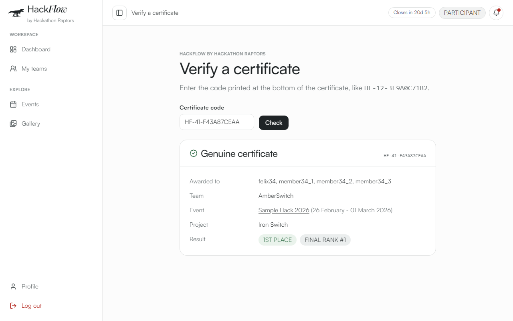 |

### 10. Long-term archival and retrieval
Finished events stay in HackFlow: **Past events** plus search finds any of them years
later, with its winners, gallery and standings. Every event exports as one JSON backup
(config, rubrics, teams, submissions, stages) that imports into any HackFlow, and CSV
exports cover users, submissions, assignments, raw scores and normalized results. The audit
log keeps every consequential action.

| Past events, searchable | One-file backup |
|---|---|
| 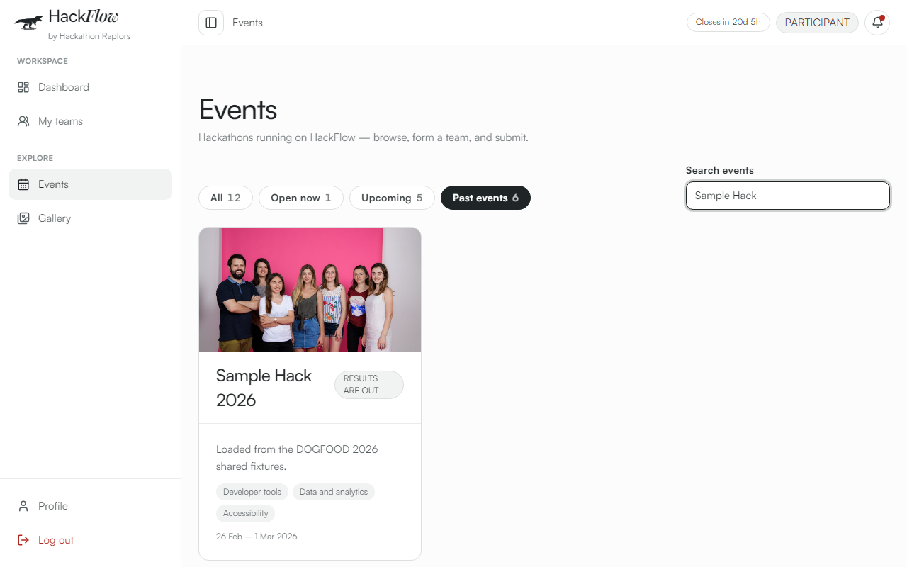 | 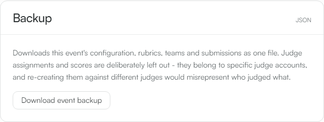 |

### Integrations: API first
Every action in the app is a documented endpoint (`/docs`, `/openapi.json`). Organizers
create **API keys** on the Integrations page, and a third-party server sends
`Authorization: Bearer hf_...` to act with exactly that organizer's role. Signed webhooks
push events out.

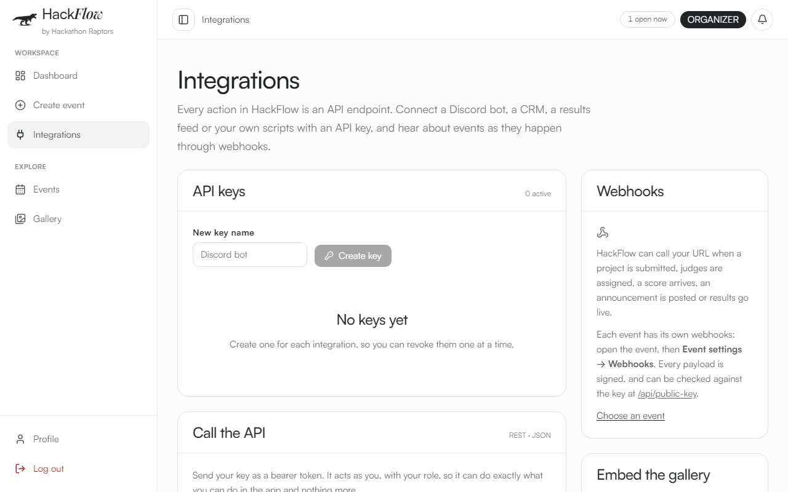

## Quickstart

```bash
docker compose up
```

That's it: no `.env` to fill in, no separate seed script, no manual migration step. The
API creates its schema and seeds fixture data automatically on first boot. Open
`http://localhost:8000`.

**Is `.env` needed? No.** Every setting has a working default, and with no `.env` HackFlow
sends no email and makes no outbound network calls. `.env.example` lists the optional extras,
all for going live: `SMTP_*` for self-service password-reset and verification emails, and
`APP_BASE_URL` for the address used in email links and on certificates. Copy it to `.env`
only when you want those (see [Email](#email-optional-self-service-password-resets)).

Seeded accounts (see `fixtures/users.json`); the password is the value shown:

| Role | Email | Password |
|---|---|---|
| Organizer | `alice@example.com` | `organizer-pass1` |
| Admin | `priya@example.com` | `admin-pass123` |
| Judge | `sam@example.com` (and `mina@`, `omar@`, `dana@`) | `judge-pass123` (see fixture for the others) |
| Participant | `jordan@example.com` (and 6 others) | `participant-pass1` (see fixture) |

Anyone can also register a new account from the app. Public sign-up always creates a
`participant`. Judges join by an event's invitation link, and organizers by an admin's
invitation link or an admin changing their role on **Users**. Admins exist only in the seed
data (see [docs/PLAN.md](docs/PLAN.md)'s Open Questions for why).

Two seeded events are worth knowing for a demo:

| Event | State | Use it to show |
|---|---|---|
| `dogfood-2026`: HackFlow Hackathon 2026 | Open for submissions | Teams, submissions, project links, announcements, voting |
| `judging-showcase-2026`: Raptor Judging Showcase | Submissions closed, results hidden | Judge assignment, scoring, judging progress, conflicts, winners |

Judging opens only once an event's submissions close, which is why the second one exists.

The official DOGFOOD `fixtures.json` (repo root) is loaded as a third event,
`sample-hack-2026`: 8 tracks, 30 judges, 40 teams, 40 submissions and 123 scores, closed
at the fixture's `submissions_close` (2026-03-01), so it refuses new submissions. Every
account it creates (e.g. judge `tomas.varga@example.org`, participant `priya1@example.org`)
has the password `dogfood2026`. How the loader handles the fixture's awkward cases:

- **Duplicate submission.** `prj_41` is team `tm_07` submitting the same repo a second
  time. A team has one submission here, so it merges into `prj_07`. Where a judge scored
  both copies, only their first score is kept.
- **A judge who gave the same score to everything.** Kept as is. Normalisation gives that
  judge zero influence (`JUDGING.md`).
- **Unfinished batches, uneven review counts.** The fixture has scores but no
  assignments, so each score becomes one assignment. Projects end up with 2 to 5 reviews
  and nothing assumes a fixed number.

### Acceptance checker

`.dogfood.toml` points the DOGFOOD checker at this stack, and `acceptance-report.txt` is
what it printed:

```bash
docker compose down -v && docker compose up --build   # fresh volume: ids below are fixed
python run.py .dogfood.toml > acceptance-report.txt
```

The checker never logs in. It sends fixed cookies, which the API accepts because
`docker-compose.yml` sets `DEMO_SESSION_TOKENS`. The API prints the matching
`.dogfood.toml` values at boot. **On a real deployment, delete that line and change
`SESSION_SECRET`.** Anyone who has one of those tokens is signed in as that account.

Upgrading an existing install needs no reset: new columns are added at boot
(`db.add_missing_columns()`). To go back to a clean, fixture-only state anyway (e.g.
before a demo):

```bash
docker compose down -v
docker compose up --build
```

## Deploy it: live in minutes

HackFlow is one Docker image plus Postgres. No Node, Python, or database to install on the
host, no build step to run by hand, no migrations, no seed script. Anywhere that runs Docker
runs HackFlow.

[](https://render.com/deploy?repo=https://github.com/sarvan-2187/dog-food)

| Where | Cost (approx.) | Time to live | Keeps uploads & signing key | How |
|---|---|---|---|---|
| **Render** (free) | Free, no card | ~10 min | No: reset on restart | Click the button above, or **New → Blueprint** on this repo. `render.yaml` creates the site and database. |
| **Any VPS** (Hetzner, DigitalOcean, Vultr, Hostinger) | ~$4–6 a month | ~5 min | Yes | Commands below |
| **Google Cloud / AWS / Azure VM** | Free-trial credit | ~5 min | Yes | Commands below |
| **Oracle Cloud Always Free** (ARM) | Free | ~5 min | Yes | Commands below. Images build for ARM as-is. |
| **Your own laptop + Cloudflare Tunnel** | Free, no account | ~2 min | Yes | `docker compose up`, then `cloudflared tunnel --url http://localhost:8000`. The link lives only while the laptop is on. |

**On any server with Docker:**

```bash
git clone https://github.com/sarvan-2187/dog-food.git && cd dog-food
docker compose up -d --build
```

The site answers on port 8000. For a public deployment, first:

- **Delete the `DEMO_SESSION_TOKENS` line** in `docker-compose.yml`. It grants fixed, passwordless sessions for the acceptance checker.
- Set a real `SESSION_SECRET` and change the Postgres password.
- Set `APP_BASE_URL` to your public address, and put HTTPS in front (Caddy or Cloudflare).
- Change the seeded account passwords.

**Pick a region near your users.** For the DOGFOOD judging panel, which is mostly US-based
with the rest in Europe, US East (Virginia / New York) gives the best latency overall.

## Email (optional): self-service password resets

Out of the box HackFlow sends no email and makes **zero** outbound network calls. Anyone who
forgets their password gets a one-time reset link from an organizer (**Dashboard → Help
someone sign in**).

Point it at your own mail server and resets become fully self-service: **Forgot password?**
on the login page emails a link that works once and expires in 30 minutes. It uses plain
SMTP via Python's standard library, with no email SDK, no hosted service.

**Try it locally, with no internet:** a bundled test inbox catches every email.

```bash
docker compose -f docker-compose.yml -f docker-compose.mail.yml up
```

The app runs at `http://localhost:8000` as usual. Emails appear at **`http://localhost:8025`**.

**Real delivery:** copy `.env.example` to `.env` (git ignores it), fill it in, then
`docker compose up -d api`.

| Setting | Gmail / Workspace | Outlook / Microsoft 365 |
|---|---|---|
| `SMTP_HOST` | `smtp.gmail.com` | `smtp.office365.com` |
| `SMTP_PORT` | `587` | `587` |
| `SMTP_SECURITY` | `starttls` | `starttls` |
| `SMTP_USERNAME` | your address | your address |
| `SMTP_PASSWORD` | an *app password* (needs 2-step verification) | an *app password* |
| `SMTP_FROM` | `HackFlow <you@your-domain>` | same |
| `APP_BASE_URL` | the URL people use to reach HackFlow (default `http://localhost:8000`) | same |

Then sign in as an admin and press **Send test email** on the dashboard's **Email delivery**
card. It reports the mail server's answer in plain language. Delivery itself is up to your
provider: a brand-new sending address can land in spam until the domain has SPF/DKIM set up.

**Locked-out admin?** `docker compose exec api python -m app.auth.reset_link you@example.com`
prints a one-time reset link for any account.

## What's here

- **Event lifecycle**: new events start as **drafts** only organizers can see, and go
  public with **Publish**. Dates, rules, tracks, prizes and team-size cap are all editable
  from Event settings, including **Close submissions now**. Every event shows its phase
  (Upcoming / Open / Judging / Results) and a countdown worded for it.
- **Multi-event judging**: each event has its own judge panel. Judges are invited *to an
  event*, and assignment only ever draws from that event's panel. Judging opens when
  submissions close, so nobody scores a project its team can still change.
- **Judging progress**: "X of Y scores in", each judge's progress (furthest behind
  first), removing a judge who dropped out (their scores stay; their unscored work is
  re-assigned), email reminders, and judges can declare a conflict of interest.
- **Winners**: each configured prize is awarded to a project, suggested from the
  standings and confirmed by the organizer. Winners appear on the event page and
  certificates at the results reveal.
- **Announcements**: organizers post updates to everyone in an event. They appear on the
  event page and participants' dashboards, can be emailed, and are sent to the event's
  webhooks.
- **Team management**: one team per person per event; members can leave; the captain
  renames the team, removes members, hands over captaincy and replaces the invite link.
- **Project links**: code, live demo and video links on every submission, validated
  (http/https only), shown to judges and in the gallery. Linked, never embedded.
- **Admin users**: search accounts, change roles, deactivate, and invite organizers by
  link. The admin role is never granted from the UI.
- **Sign-in protection**: failed logins are limited per account and per IP, and checked
  before the password, so a correct guess made after the limit is still refused.
  Responses take the same time whether or not the account exists.
- **Account recovery**: "Forgot password?" emails a single-use reset link when email is
  set up. Otherwise organizers issue one from their dashboard, and a server command
  covers a locked-out admin. Any password change signs the account out everywhere.
  Profile has **Change password** and name editing.
- **Team formation**: a participant creates a team or joins one via a shareable invite
  link (server-side expiry, not just a UI hide), capped at a per-event max team size
  (default 4, matching Dogfood's own rule) enforced server-side.
- **Submissions**: one per team, autosaving as you type, with a visible
  "Saving… / Saved / Unsaved changes" indicator and a server-enforced deadline that's
  never a surprise (the countdown is always on the page).
- **Judging**: a deterministic, conflict-aware assignment algorithm; an event can hold
  several weighted rubrics (e.g. Technical + Presentation), combined into one score form
  and locked once scoring starts; per-judge z-score normalization so one harsh judge
  doesn't distort the ranking. See `JUDGING.md`.
- **Public gallery & voting**: scoped per hackathon (pick an event, then see its gallery),
  one vote per person, with the organizer choosing who votes (signed-in accounts, anyone who
  confirms an email, or anyone with the link), rate-limited, with results held back until a configured reveal time
  so early counts can't sway the vote. This is enforced in the API response itself, not just
  hidden in the UI.
- **Uploaded images**: submission screenshots and profile avatars, stored on local disk
  behind a swappable `StorageService` interface, with no cloud account or CDN, works fully
  offline. See `ARCHITECTURE.md`.
- **CSV export**: users, submissions (with their project links), assignments, raw
  scores, normalized results, for every event, organizer/admin only.
- **Append-only audit log**: every consequential action, timestamped, organizer/admin
  readable, with no update or delete path from any endpoint.
- **Certificates & signed records**: server-rendered participation certificates (PDF, no
  external service) that name any prize won, and judge participation records signed with a local Ed25519 key,
  verifiable offline against `GET /api/public-key` without trusting the server again.
- **Bulk event export/import**: an event's config (including rules), rubric, teams and
  submissions (including links) as one JSON file, for backup or migration between
  environments. An import arrives as a draft, and its links are validated like any other.
- **Guided onboarding**: a role-aware tour (driver.js, bundled, no network calls) starts
  once on first login and is replayable from `/profile`, so a fresh cohort of participants
  and judges can be pointed at the site rather than at a support doc. See
  [docs/USER-MANUAL.md](docs/USER-MANUAL.md).
- **API keys**: organizers and admins create named keys on **Integrations**; a server sends
  `Authorization: Bearer hf_...` and acts with exactly its owner's role. Keys are shown once,
  stored as SHA-256 hashes, revocable, and die with a deactivated owner.
- **Event stages**: named rounds (Stage 1, Stage 2, ...) with dates and descriptions, edited
  in Event settings and shown as a timeline on the event page, current stage highlighted.
- **Verifiable certificates**: every certificate carries a serial (`HF-<id>-<HMAC>`) that
  `/verify` checks publicly, showing members, event, project, prize and rank.
- **Automatic eligibility checks**: missing or duplicate repository, thin description, no
  track, oversized team, flagged on the Eligibility card for the organizer to rule on.
- **Archive**: the Events page filters to Open now / Upcoming / Past events and searches by
  name, theme or track.
- **Outbound webhooks**: organizers opt an event into signed HTTP callbacks for every
  action taken in that event, 44 topics named after the audit action
  (`event.updated`, `vote.cast`, `score.submitted`, ...; full list in ARCHITECTURE.md),
  each payload signed with the same Ed25519 key used for judge
  participation records, so a receiver can verify it without trusting the network.

Role-based access control is enforced at the endpoint level throughout: `require_role()`
is written once (`api/app/auth/deps.py`) and imported everywhere; there is no role check
that lives only in the frontend.

## Known limits

- **Voting still can't stop someone with several real inboxes.** An event can require a
  verified email and set a voter cutoff (accounts made later can't vote), and organizers can
  void votes cast from one device by several voters. A person who registered several
  verified accounts before the cutoff still gets several votes. See [docs/THREAT-MODEL.md](docs/THREAT-MODEL.md)
  entry 25.
- **The judging deadline is soft, on purpose.** Judges see the due date and organizers see
  who is overdue, but a late score still saves (flagged late in the audit log). Locking
  scoring would leave projects with no reviews.
- **Disqualification has no appeal flow in the app.** The team sees the reason and is told
  to contact the organizers; reinstating is one click and restores the entry's scores.
- **The gallery widget is a read-only list.** No search, filters or voting inside the
  embed. Those stay on the full gallery it links to.

## Status

510 tests passing across three suites, run live against this exact stack:

| Suite | Command | Result |
|---|---|---|
| Backend | `docker compose exec api pytest tests/ -v` | 387 passed |
| Frontend unit | `cd web && npm test` | 9 passed |
| Browser E2E | `cd web && npx playwright test` | 114 passed, 1 skipped |

The skipped spec is the emailed password-reset flow. It needs the local test inbox, so
it runs only when the stack is started with `docker-compose.mail.yml` (see "Email"
above), and skips itself otherwise.

The browser suite changes the same database it reads. Against a fresh stack it passes in
full with Playwright's default parallel workers. After many runs on one volume, one or two
specs can time out; each passes on its own, and `--workers=1` or a fresh volume avoids it
(see [docs/PLAN.md](docs/PLAN.md)'s Open Questions).

`acceptance-report.txt` is the unedited output of the official DOGFOOD checker
(`run.py`): 7 of 7 checks pass, and T1 and T2 are verified. T3 is claimed too. The
organisers judge T3 and T4 by hand because `run.py` has no checks for them, so the
report's "claimed but not verified: T3, T4" line is expected. T4 is claimed now that the
embeddable gallery widget exists (`/embed/events/{slug}`, copy the snippet from **Event
settings → Embed on your site**). The earlier self-issued report, written
before the checker was published, is kept at `docs/self-test-report.txt`.

## Documentation

The full list, with what each document is for, is under [For evaluators](#for-evaluators).

## Development

```bash
# Backend tests (needs the stack up)
docker compose exec api pytest tests/ -v

# Frontend unit tests
cd web && npm ci && npm test

# Browser end-to-end tests (needs the stack up)
cd web && npx playwright install --with-deps chromium
npx playwright test

# ...including the emailed password-reset flow, against the local test inbox
docker compose -f docker-compose.yml -f docker-compose.mail.yml up -d
npx playwright test recovery.spec.ts
```

## Tech stack

Python 3.12 · FastAPI · SQLModel (SQLAlchemy 2.0 + Pydantic) · PostgreSQL 16 · session
cookies signed with `itsdangerous`, passwords hashed with `passlib[bcrypt]` · React +
TypeScript + Vite · Tailwind CSS · driver.js (guided tour, bundled) · optional email over
Python's standard-library `smtplib` · pytest + httpx (backend) · Vitest (frontend unit) ·
Playwright (browser E2E). Every dependency is pinned to an exact version
(`api/requirements.txt`, `web/package.json` + `package-lock.json`); nothing in the runtime
image reaches the network beyond the standard package registries at build time.

## License

MIT. See `LICENSE`.
