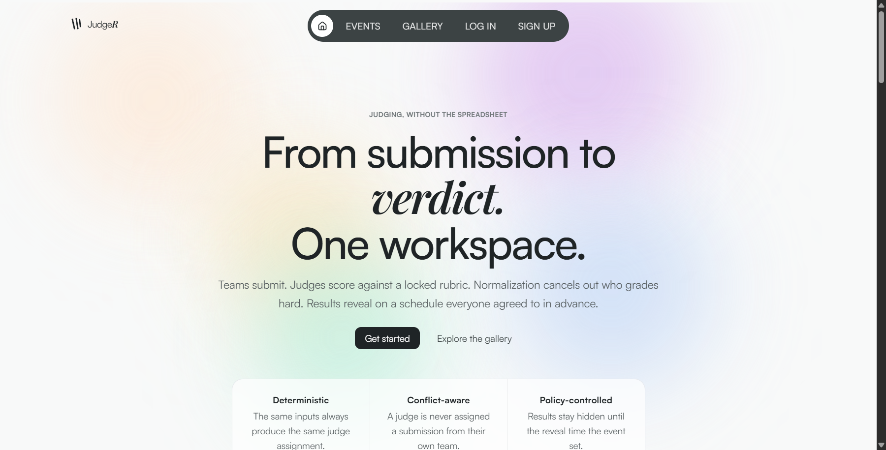
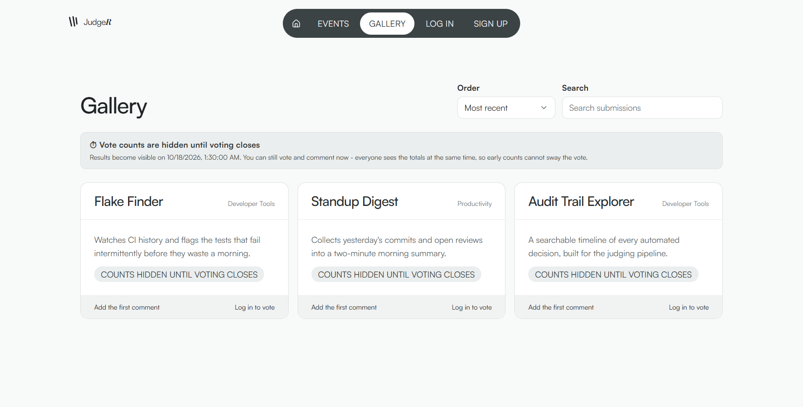
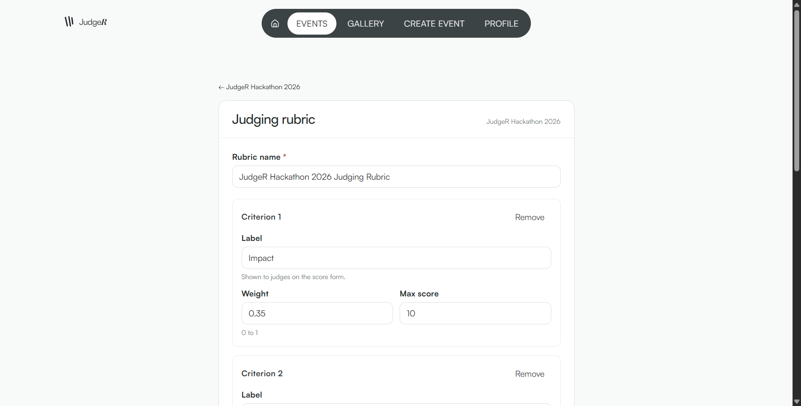
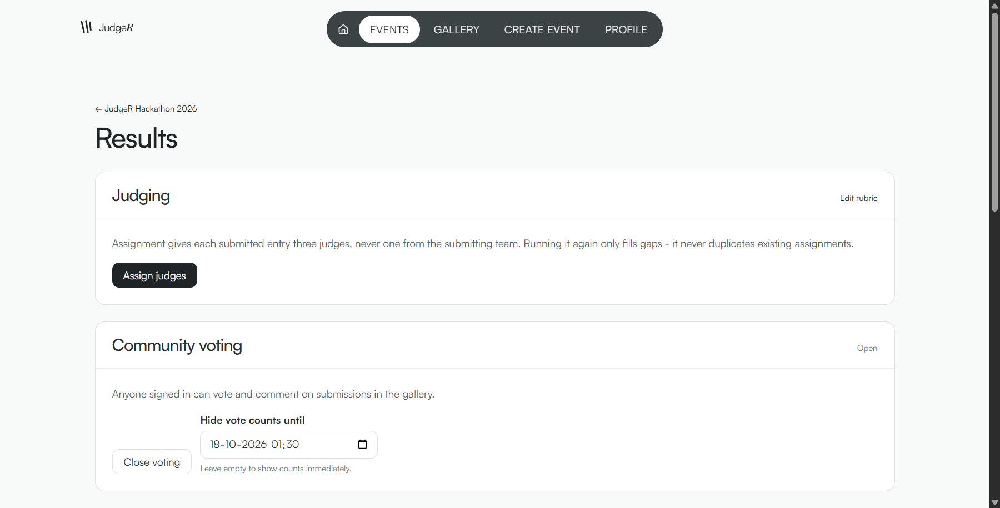

# JudgeR — Judge Raptors

[](LICENSE)
[](acceptance-report.txt)
[](api/requirements.txt)
[](api/requirements.txt)
[](web/package.json)
[](web/package.json)
[](docker-compose.yml)
[](docker-compose.yml)

A self-contained hackathon operations platform: event creation, team formation, submission
drafting, judge assignment, weighted-and-normalized scoring, and public voting with
timed results reveal — for an organization like [Hackathon Raptors](https://raptors.dev)
running several branded events with a judged proof pipeline and public results, not a
single-event demo.

Built by Team CodeHawk against `PLAN.md`, the execution spec for this build.

## Screenshots

All captured live against the running `docker compose` stack on fixture-only data —
none of these are mockups.

| | |
|---|---|
| **Landing** — RiskSentinel-style hero, raptors.dev's own gradient palette | **Public gallery** — voting, comments, results held back until reveal |
| [](docs/screenshots/landing-hero.png) | [](docs/screenshots/gallery.png) |
| **Judging rubric** — weighted criteria, live "weights add up to 1.00" check | **Event control** — assignment, rubric lock, voting/reveal controls |
| [](docs/screenshots/rubric-builder.png) | [](docs/screenshots/results.png) |

## Quickstart

```bash
docker compose up
```

That's it — no `.env` to fill in, no separate seed script, no manual migration step. The
API creates its schema and seeds fixture data automatically on first boot. Open
`http://localhost:8000`.

Seeded accounts (see `fixtures/users.json`) — password is the value shown:

| Role | Email | Password |
|---|---|---|
| Organizer | `alice@example.com` | `organizer-pass1` |
| Admin | `priya@example.com` | `admin-pass123` |
| Judge | `sam@example.com` (and `mina@`, `omar@`, `dana@`) | `judge-pass123` (see fixture for the others) |
| Participant | `jordan@example.com` (and 5 others) | `participant-pass1` (see fixture) |

Anyone can also register a new account from the app — public sign-up always creates a
`participant`; the other three roles exist only via the seed data (see PLAN.md's Open
Questions for why).

To reset to a clean, fixture-only state (e.g. before a demo):

```bash
docker compose down -v
docker compose up --build
```

## What's here

- **Event lifecycle** — organizer/admin create and later edit an event's dates, tracks,
  prizes, and team-size cap from a real settings screen, not a raw API call.
- **Team formation** — a participant creates a team or joins one via a shareable invite
  link (server-side expiry, not just a UI hide), capped at a per-event max team size
  (default 4, matching Dogfood's own rule) enforced server-side.
- **Submissions** — one per team, autosaving as you type, with a visible
  "Saving… / Saved / Unsaved changes" indicator and a server-enforced deadline that's
  never a surprise (the countdown is always on the page).
- **Judging** — a deterministic, conflict-aware assignment algorithm; an event can hold
  several weighted rubrics (e.g. Technical + Presentation), combined into one score form
  and locked once scoring starts; per-judge z-score normalization so one harsh judge
  doesn't distort the ranking. See `JUDGING.md`.
- **Public gallery & voting** — scoped per hackathon (pick an event, then see its gallery),
  one vote per person, rate-limited, with results held back until a configured reveal time
  so early counts can't sway the vote — enforced in the API response itself, not just
  hidden in the UI.
- **Uploaded images** — submission screenshots and profile avatars, stored on local disk
  behind a swappable `StorageService` interface — no cloud account or CDN, works fully
  offline. See `ARCHITECTURE.md`.
- **CSV export** — users, submissions, assignments, raw scores, normalized results, for
  every event, organizer/admin only.
- **Append-only audit log** — every consequential action, timestamped, organizer/admin
  readable, with no update or delete path from any endpoint.
- **Certificates & signed records** — server-rendered participation certificates (PDF, no
  external service), and judge participation records signed with a local Ed25519 key,
  verifiable offline against `GET /api/public-key` without trusting the server again.
- **Bulk event export/import** — an event's config, rubric, teams, and submissions as one
  JSON file, for backup or migration between environments.
- **Outbound webhooks** — organizers opt an event into signed HTTP callbacks
  (`submission.submitted`, `assignments.run`, `score.submitted`,
  `event.results_revealed`), each payload signed with the same Ed25519 key used for judge
  participation records, so a receiver can verify it without trusting the network.

Role-based access control is enforced at the endpoint level throughout — `require_role()`
is written once (`api/app/auth/deps.py`) and imported everywhere; there is no role check
that lives only in the frontend.

## Status

308 tests passing across three suites, run live against this exact stack (run the
Playwright suite serially with `--workers=1` for a deterministic count — see
PLAN.md's Open Questions on shared-dev-database contention across parallel workers):

| Suite | Command | Result |
|---|---|---|
| Backend | `docker compose exec api pytest tests/ -v` | 215 passed |
| Frontend unit | `cd web && npm test` | 9 passed |
| Browser E2E | `cd web && npx playwright test --workers=1` | 84 passed |

No official acceptance suite has been published for this build. `acceptance-report.txt`
is therefore self-issued from the suites above (see PLAN.md Phase 5.5) — replace it the
moment a real suite exists. Every number in this README and in that report comes from a
real run against the live stack; neither is hand-edited.

## Documentation

- **`PLAN.md`** — the execution spec this build follows, phase by phase, including every
  judgment call made along the way (`## Open Questions`).
- **`DESIGN_SYSTEM.md`** — the design tokens and component patterns the frontend is built
  from, derived from `reference_design.pdf`.
- **`ARCHITECTURE.md`** — system design and the modular-monolith rationale.
- **`DATA-MODEL.md`** — full schema, entity relationships, import/export paths.
- **`JUDGING.md`** — the assignment algorithm, the normalization math, and the role-
  isolation and integrity decisions behind them.
- **`THREAT-MODEL.md`** — eleven attacks, each paired with the mitigation already built
  and the file that enforces it.

## Development

```bash
# Backend tests (needs the stack up)
docker compose exec api pytest tests/ -v

# Frontend unit tests
cd web && npm ci && npm test

# Browser end-to-end tests (needs the stack up)
cd web && npx playwright install --with-deps chromium
npx playwright test
```

## Tech stack

Python 3.12 · FastAPI · SQLModel (SQLAlchemy 2.0 + Pydantic) · PostgreSQL 16 · session
cookies signed with `itsdangerous`, passwords hashed with `passlib[bcrypt]` · React +
TypeScript + Vite · Tailwind CSS · pytest + httpx (backend) · Vitest (frontend unit) ·
Playwright (browser E2E). Every dependency is pinned to an exact version
(`api/requirements.txt`, `web/package.json` + `package-lock.json`); nothing in the runtime
image reaches the network beyond the standard package registries at build time.

## License

MIT — see `LICENSE`.
