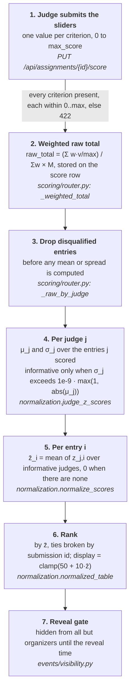

# Score normalization: how it works, what was wrong, and how well it holds up

This document checks HackFlow's judging pipeline end to end on the official DOGFOOD
fixture event (`sample-hack-2026`: 40 projects, 30 judges, 123 scores). It covers the
logic errors found in the audit and fixed on 2026-09-29, and measures whether the method
does what [`JUDGING.md`](../JUDGING.md) claims. Every number here was produced from the
running app's own `/export/scores.csv` and `/export/results.csv`, using the functions in
`src/api/app/scoring/normalization.py`.

## 1. The pipeline, step by step



Each step is enforced on the server. Nothing depends on the browser.

## 2. Logic errors found and fixed

| # | Error | Effect | Fix | Test |
|---|---|---|---|---|
| L1 | **Weights ignored the criterion's scale.** `raw_total = Σ w·v` used raw values, so a 0–100 criterion outweighed a 0–10 one regardless of the weights. | With Technical (0–10, 70%) and Presentation (0–100, 30%), Presentation carried about 81% of the total. The organizer's weights silently didn't mean what they said. | Each value is scaled by its own max before weighting, and the result is divided by Σw. It is identical to the old formula whenever every max is equal and Σw = 1, as in all shipped fixtures. | `test_weighted_total_respects_weights_across_different_max_scores`, `test_weighted_total_is_unchanged_for_a_single_scale_rubric` |
| L2 | **Zero-information judges diluted z̄.** A judge with σ = 0 (one score, or all scores equal) contributed z = 0, which was *averaged in*. | A project's z̄ was shrunk towards 0 in proportion to how many uninformative judges it happened to draw. Two projects with identical real evidence could rank differently. On the fixtures, 5 projects were diluted and 12 ranks were wrong. | Uninformative judges are left out of the mean. An entry with no informative judge gets z̄ = 0 and `informative_judges = 0`. | `test_an_uninformative_judge_does_not_change_a_projects_rank`, `test_a_project_seen_only_by_uninformative_judges_sits_at_zero` |
| L3 | **σ was compared with exact zero.** | Float noise in a weighted total (`0.1×3` vs `0.3`) made a judge who gave identical marks look like they had spread, which turned noise into z = ±1. | A relative tolerance of 1e-9. | `test_float_noise_is_not_mistaken_for_spread` |
| L4 | **Partial data was undocumented.** The brief's pitfall: "normalization must run after all judges have scored, or on-demand recompute; decide explicitly and document it." | Standings mid-judging looked final. | The decision is on-demand recompute on every read, now documented. Every row carries `judges`, `assigned_judges` and `informative_judges`, in both JSON and CSV. | results endpoint, `JUDGING.md` "Partial data" |
| L5 | **A submission's track was free text** (see also SECURITY-AUDIT #9). | An invented track dodged the eligibility flag, and the entry went only to untracked judges. | The track must be one of the event's tracks. | `test_a_submission_track_must_be_one_of_the_events_tracks` |
| L6 | **Imported rubrics accepted `max_score: 0` or NaN.** | Division by zero in L1's formula, or NaN spreading through every judge's μ and σ. | Positive and finite, or the import is refused. | import tests |

## 3. Effect of the fixes on the fixture standings

Three of the 30 judges are uninformative: `jdg_07` (4/4/4 on three projects), `jdg_01` (one
score) and one other single-score judge. Before and after L2:

| Project | Judges (informative) | z̄ before | z̄ after | Rank before → after |
|---|---|---|---|---|
| Dry Harbour | 6 (5) | +0.263 | +0.316 | 10 → 9 |
| Small Loom | 3 (2) | +0.174 | +0.262 | 13 → 11 |
| North Drift | 5 (4) | +0.156 | +0.195 | 14 → 13 |
| Hollow Signal | 3 (2) | +0.080 | +0.120 | 18 → 16 |
| Small Relay | 2 (1) | −0.238 | −0.476 | 30 → 32 |

Seven more projects move by one place because the diluted ones pass them. The top 8 and the
bottom 8 are unchanged. The Spearman correlation between the old and new orders is 0.998.
The fix corrects specific rows and leaves the method as it was.

## 4. Does normalization do what it claims?

**It removes a judge's harshness or leniency exactly.** Replace one judge's every score
with `0.5 × score − 1`, which makes the judge far harsher and compresses their scale:

- normalized z̄ for all 40 projects: **max change 0.000000** (z-scores are invariant to any
  positive linear rescaling of one judge);
- plain raw-mean ranking: **40 of 40 projects change rank**.

This is the property the method exists for, and it holds exactly, not approximately.

**It disagrees with the raw mean, as intended.** The Spearman correlation between the
raw-mean order and the normalized order is 0.821. Only 2 of 40 projects keep their raw rank,
and the largest move is 22 places (Dry Harbour). Every large move traces back to a judge
whose scale differs from the others (JUDGING.md, "Worked on the official DOGFOOD fixtures").

**It is stable against any single judge.** Recompute the standings 30 times, each time
removing one judge's scores entirely:

- the top 10 keeps on average 9.4 of its 10 projects, and never fewer than 8;
- the winner (Iron Switch) stays first in 27 of the 30 runs.

So no single judge decides the podium. Iron Switch's own three judges can each be removed
without it losing first place. The three runs where the winner changes remove a judge who
marked a *rival* below that judge's own average. With that one low opinion gone, the rival
is left with only 1 to 3 reviews and edges past Iron Switch's +1.232: Paper Anchor reaches
+1.414, Salt Loom +1.501 and Hollow Signal +1.240. This is limitation 2 below (few reviews
mean more noise), seen from the other side.

## 5. Known limitations (honest, not fixed)

1. **Two-score judges give exactly ±1.** A judge who scored two projects has z = +1 and −1
   whatever the gap, 4.9 against 5.0 or 1 against 5. Six fixture judges are in this regime.
   This is inherent to per-judge z-scores on tiny samples. Assigning each judge more entries
   is the remedy (`judges_per_submission`), and robust alternatives (rank-based, Bayesian
   shrinkage) trade away the simple, explainable math the brief rewards.
2. **Few reviews mean more noise.** Eight fixture projects have only 2 reviews, one of them
   (Small Relay) with only 1 informative review. Its z̄ is one judge's opinion. The new
   `informative_judges` column makes this visible instead of hiding it.
3. **Collusion isn't detected.** Normalization removes a judge's *general* bias, not a bias
   towards one project (THREAT-MODEL #27). The raw per-judge CSV and the audit log are the
   evidence trail.
4. **Ties share no rank.** Equal z̄ is broken by submission id so reruns are deterministic.
   The award picker is a suggestion the organizer confirms, so a tie at a prize boundary is
   a human call.
5. **Stored totals aren't rewritten.** A score saved before L1 under a mixed-scale rubric
   keeps its old `raw_total` until re-scored. No shipped fixture is affected.

## 6. Reproduce

```bash
docker compose up --build
curl -s -H "Cookie: session=demo-org-7f2a" localhost:8000/api/events/10/export/results.csv
docker compose exec api pytest tests/test_scoring.py -v
```
