# HackFlow by Hackathon Raptors: User Manual (v3)

This manual walks through HackFlow one screen at a time, in the order you will actually
meet them. Every screenshot in it was taken from a real running copy of the software on
its built-in sample data. Nothing here is a mock-up or a drawing. (They are regenerated
with `cd src/web && node scripts/manual-screenshots.mjs` against a running `docker compose up`.)

You do not need to be technical to use this manual. If you can use a website, you can use
HackFlow.

**Contents**

1. [What HackFlow is](#1-what-hackflow-is)
2. [Getting in](#2-getting-in)
3. [The four kinds of account](#3-the-four-kinds-of-account)
4. [The guided tour](#4-the-guided-tour)
5. [For participants: entering a hackathon](#5-for-participants-entering-a-hackathon)
6. [For judges: scoring projects](#6-for-judges-scoring-projects)
7. [For organizers: running the event](#7-for-organizers-running-the-event)
8. [For admins: running the site](#8-for-admins-running-the-site)
9. [Troubleshooting](#9-troubleshooting)

---

## 1. What HackFlow is

HackFlow runs a hackathon from beginning to end: people sign up, form teams, write up their
projects, judges score them fairly, and results are published at a time the organizer
chooses.

It is one self-contained website. There is no separate app to install, no third-party
service to sign up for, and it keeps working with the internet disconnected.

---

## 2. Getting in

If someone has already set HackFlow up for you, they will have given you a web address.
Open it and skip to the login screen below.

If you are setting it up yourself, you need [Docker](https://www.docker.com/) installed.
Open a terminal in the project folder and run one command:

```bash
docker compose up
```

Wait until it stops printing new lines, then open **http://localhost:8000** in your browser.
The site sets itself up and fills itself with sample data on first start, and there is nothing
else to configure.

### Putting it online (optional)

To give people a web address instead of `localhost`, the project includes a ready-made setup
for [Render](https://render.com), which has a free plan and needs no credit card.

1. Put the project in your own GitHub repository.
2. On Render, sign in with GitHub, choose **New → Blueprint**, pick the repository, and
   choose **Apply**. Render reads `render.yaml` and creates the site and its database. The
   first build takes 5–10 minutes.
3. When it is live, open the site's **Environment** tab and set `APP_BASE_URL` to its
   address (for example `https://hackflow-xxxx.onrender.com`).
4. Optional: the free plan puts the site to sleep after 15 minutes without visitors, and
   the next visit waits about a minute. A free monitor such as
   [UptimeRobot](https://uptimerobot.com) that opens `/healthz` every 5 minutes keeps it
   awake.

Know the free plan's limits before relying on it:

- **Uploaded images and the signing key are erased whenever the site restarts.**
  Certificates and judge records signed before a restart will stop verifying.
- **The free database expires after about 30 days.**
- **The sample accounts below work on the public site**, so anyone can sign in as the
  sample organizer. Fine for a demo; change those passwords before a real event.

For a real event, run `docker compose up` on a server of your own instead, where nothing is
erased.

### Logging in

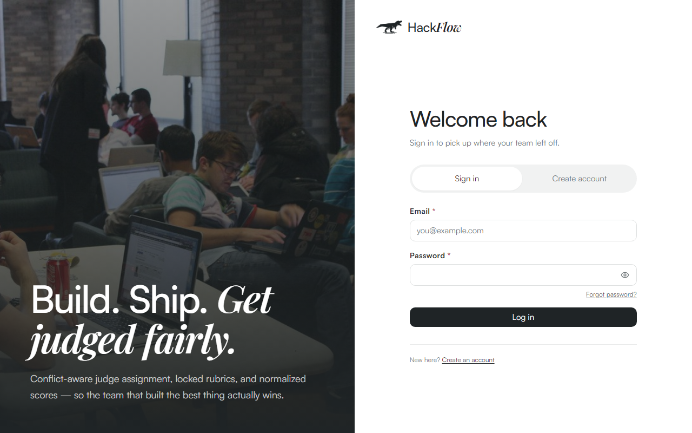

Enter your email and password and choose **Log in**.

The sample data comes with accounts you can use to look around. Each row is a different
kind of account, so you can see how the site changes depending on who you are:

| Kind of account | Email | Password |
|---|---|---|
| Organizer | `alice@example.com` | `organizer-pass1` |
| Admin | `priya@example.com` | `admin-pass123` |
| Judge | `sam@example.com` | `judge-pass123` |
| Participant | `jordan@example.com` | `participant-pass1` |

### Creating your own account

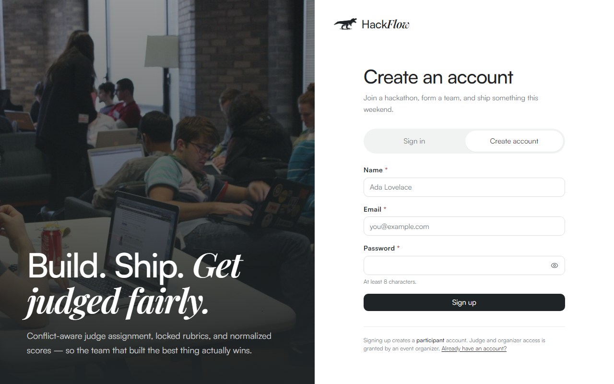

Choose **Sign up** if you do not have an account. You need a name, an email address, and a
password of at least eight characters.

Anyone who signs up publicly becomes a **participant**, somebody who enters projects.
Judge, organizer, and admin accounts cannot be self-created, on purpose: those roles can see
scores, so somebody already trusted has to grant them. (Judges and organizers are brought in
by invitation link; see sections 7 and 8.)

### Forgot your password?

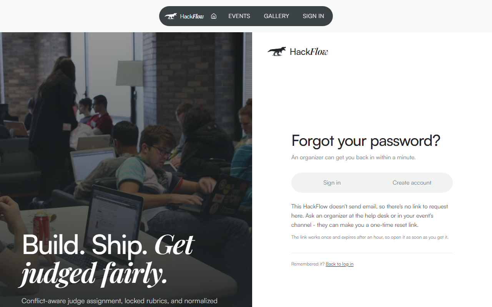

Choose **Forgot password?** under the password box on the login page.

- **If your event has email set up**, enter your address and you will get a link. It works
  once and expires after 30 minutes. Nothing arriving? Check spam, then ask again.
- **If it does not**, the page tells you so. Ask an organizer at the help desk or in your
  event's channel for a reset link (section 7, *Helping someone sign in*). It works once and
  expires after an hour.

Either way, choosing the new password signs you straight in and signs you out everywhere
else.

---

## 3. The four kinds of account

What you see across the top of the site changes depending on which kind of account you have.
You are never shown a button that would refuse you.

| Account | What it is for | What it can do |
|---|---|---|
| **Participant** | Entering the hackathon | Join or create a team, write and submit a project, browse, vote and comment in the gallery |
| **Judge** | Scoring entries | See only the projects assigned to them, score those, and step back from a project they have a conflict with |
| **Organizer** | Running an event | Create and publish events, write scorecards, invite judges, assign judging, post announcements, pick winners, publish results, export data, help people sign in |
| **Admin** | Running the whole site | Everything an organizer can do, plus managing accounts and inviting organizers |

---

## 4. The guided tour

The first time you log in, HackFlow offers a short tour of the screens you will use. It is
tailored to your kind of account: a participant, a judge and an organizer are each shown
different things.

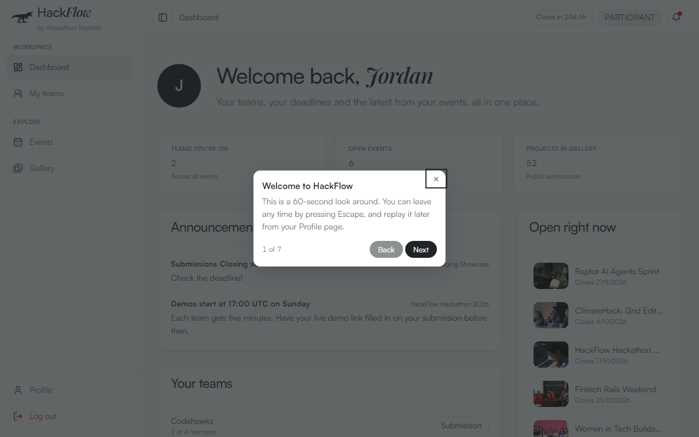

- **Next** and **Back** move through it.
- **Escape**, or the **×**, leaves at any point.
- It highlights the real thing it is describing, like the **My teams** tab here:

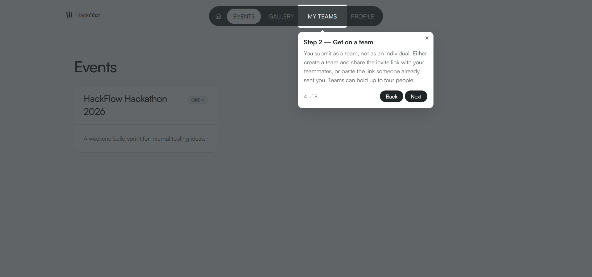

Organizers get a longer tour (ten steps, covering judging progress, winners and
announcements), and judges get one about scoring alone and fairly:

| Organizer tour | Judge tour |
|---|---|
| 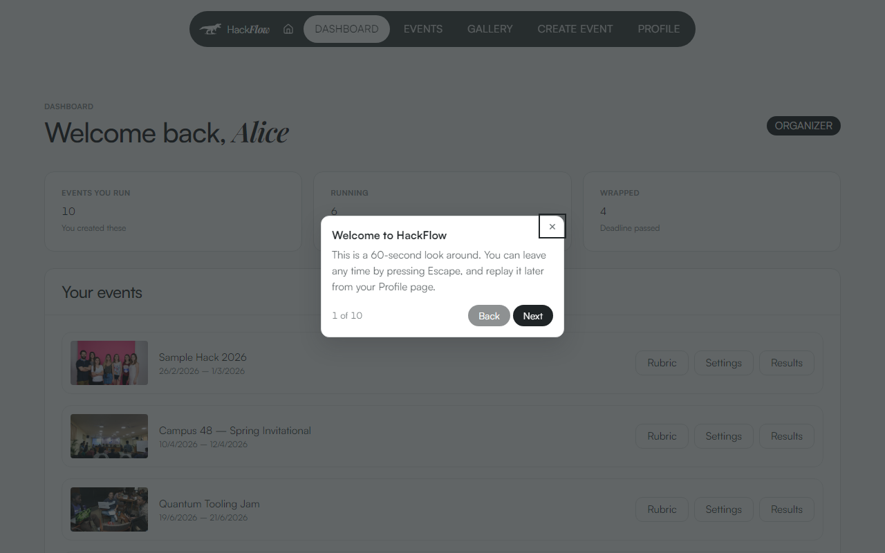 | 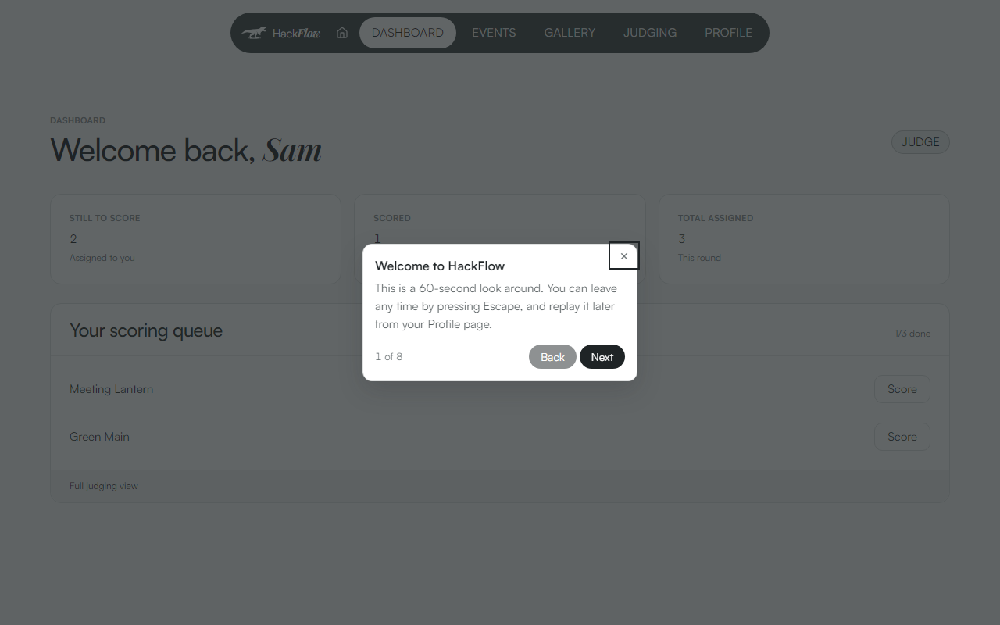 |

You only get it automatically once. To see it again at any time, open **Profile** and choose
**Replay the guided tour**.

---

## 5. For participants: entering a hackathon

### Step 1: Open the hackathon

Choose **Events** in the menu, then click the hackathon you are entering.

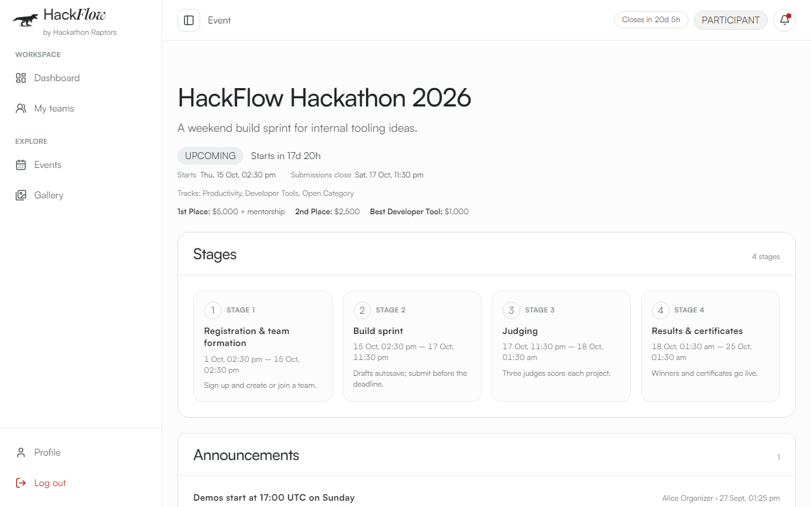

This page is the hackathon's front page. It shows:

- **The countdown**: how long you have left. This is the real deadline, not a suggestion:
  when it runs out the site stops accepting changes to your project.
- **Tracks**: the themes you can enter under, if the organizer set any up.
- **Prizes**: what is on offer.
- **Announcements**: messages from the organizers ("demos start at 5"). The newest ones
  also appear on your **Dashboard**, so you do not have to keep checking.
- **Rules** and **How projects are judged**: the scorecard judges will use, so you know
  what counts before you start.
- **Stages**: the event's rounds in order (Stage 1: Registration, Stage 2: Build sprint, and
  so on), with dates. The stage happening now is highlighted.
- **Your team**, once you have one.

### Step 2: Get on a team

You enter as a team, even if you are alone in it. There are two ways onto one.

**If you are starting the team:** choose **Create a team** on the event page and give it a
name. You become its **captain** and get an **invite link** to send to the people joining
you.

**If somebody invited you:** open the link they sent. You will be added and shown a
confirmation. Opening the same link again is harmless. It just tells you that you are
already on the team.

You can be on **one team per hackathon**, and **teams have a size limit**, usually four
people, set by the organizer. Once a team is full, its invite link stops working and the page
says so plainly, rather than failing silently.

The **Your team** card on the event page is where the team is managed:

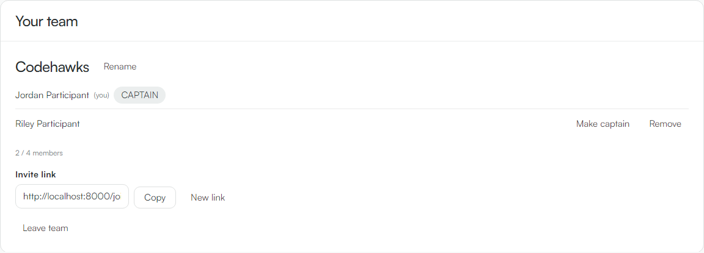

- **Copy** the invite link to share it. **New link** replaces it, so the old one stops
  working immediately. Useful if it was posted somewhere public.
- The **captain** can **Rename** the team, **Remove** someone, or **Make captain** to hand
  the role on.
- **Leave team** takes you off it (to join a different one, for example). If you were the
  captain, the longest-standing member takes over. The last member of a team cannot leave
  once it has submitted.

You can see all your teams at any time under **My teams**:

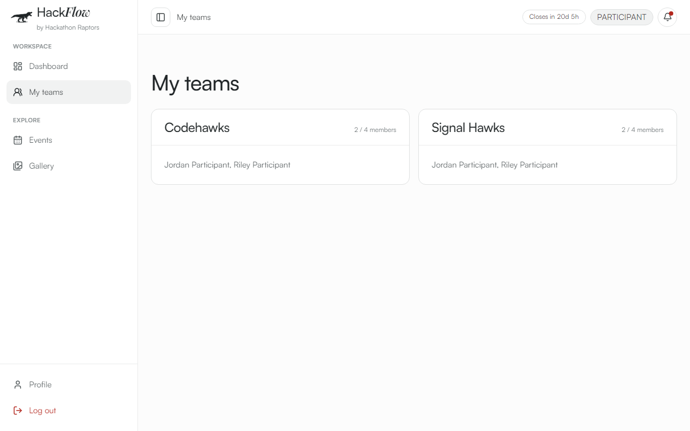

The `2 / 4 members` on each card is the team's current size against the limit.

### Step 3: Write up your project

From your team, choose **Go to your submission**. Each team gets exactly one project page.

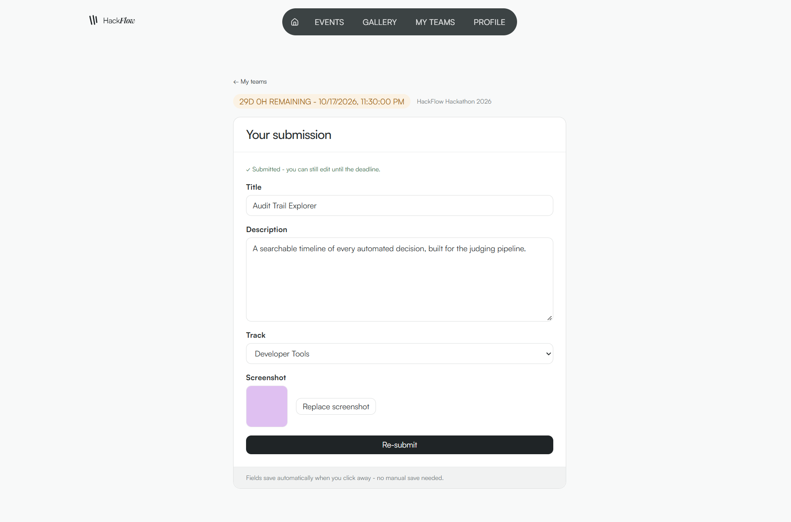

Important things about this screen:

- **It saves by itself.** There is no Save button to forget. A small marker near each field
  tells you whether your work is *Saving…*, *Saved*, or has *Unsaved changes*.
- **The deadline is always on screen**, at the top, so it can never take you by surprise.
- **Track** is a drop-down when the organizer has set up themes, so you cannot mistype it.
- **Links for the judges**: fill in **Code repository**, **Live demo** and **Demo video**.
  Judges see them on their scoring screen.
- **A screenshot** of your project can be uploaded; it becomes the picture in the gallery.
- You can keep editing right up to the deadline, even after you have submitted.

When you are ready, choose **Submit for judging**. Your project then appears in the public
gallery. You can still edit it until the deadline passes.

### Step 4: Browse and vote

**Gallery** shows everything that has been submitted. Pick the hackathon, then browse,
search, or change the order.

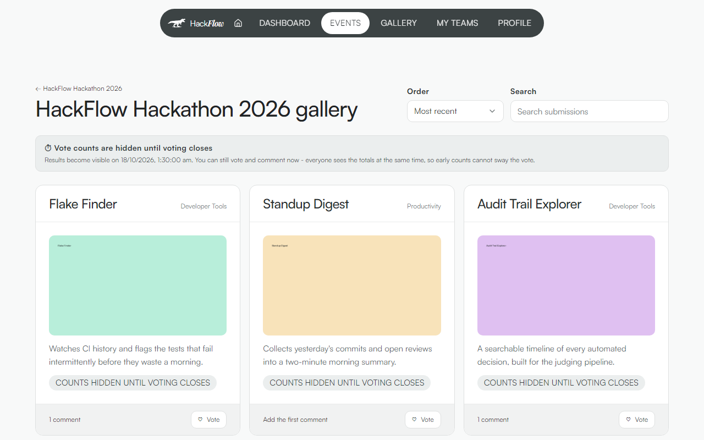

Click any project to read it in full and, if the organizer has turned voting on, to vote
for it and leave a comment:

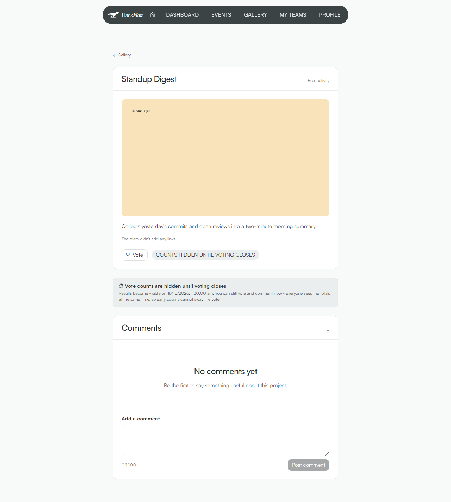

A few things are deliberately true here:

- **One vote per person per project**, and you can take your vote back.
- **Who can vote is the organizer's choice.** Usually you need to be logged in. Some events
  let anyone with the link vote, and some ask guests for an email address first. You will
  see a **Vote without an account** box, and the link emailed to you lets you vote from that
  browser.
- **Vote counts stay hidden** until the organizer's chosen reveal time, so an early lead
  cannot snowball. They are genuinely hidden, not just left off the screen.
- **The order is shuffled by default while voting is open**, so the projects at the top do not get an unfair advantage. Each visitor keeps the same order for their whole session. Events without voting list the most recent first. You can switch the order yourself at any time.
- **You can filter the gallery** by track and by tech tag, next to the search box. Search also matches taglines and tags.

Once results are revealed, your team can download a **participation certificate** from your
project page. It names every member, the event, your project and any prize or rank, and
carries a code at the bottom. Anyone you show it to (an employer, a university) can check it
is genuine at **/verify** on the same HackFlow, with no account needed.

### Your account

**Profile** holds your name, email, photo, password change, the log-out button, and the tour
replay button.

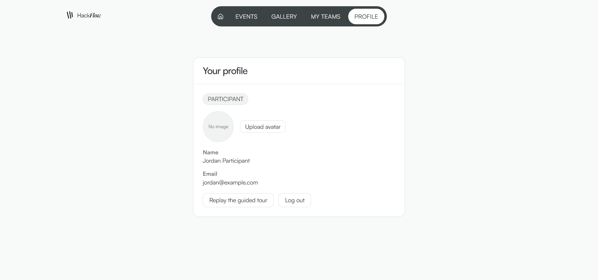

- **Name → Edit** changes how you appear.
- **Change password** signs you out on every other device.

---

## 6. For judges: scoring projects

### Step 1: Accept your invitation

Judges join by invitation only. Your organizer will send you a link; open it while logged in
and accept. Your account becomes a judge account, you join that event's judging panel, and a
**Judging** tab appears in the menu.

### Step 2: Your list

**Judging** is your home base.

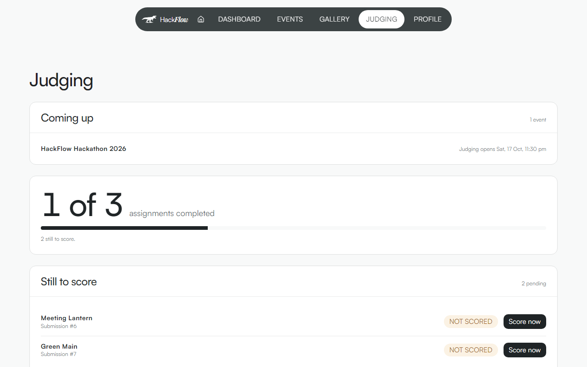

- **Coming up** lists events you judge whose submissions have not closed yet, and when
  judging opens for each. Judging never starts while teams can still edit, so you always
  score the version that was actually submitted.
- The big number is how many of your assigned projects you have finished.
- **Still to score** lists what is left. You are shown **only** the projects assigned to you.

Choose **Score now** on any of them.

### Step 3: Score a project

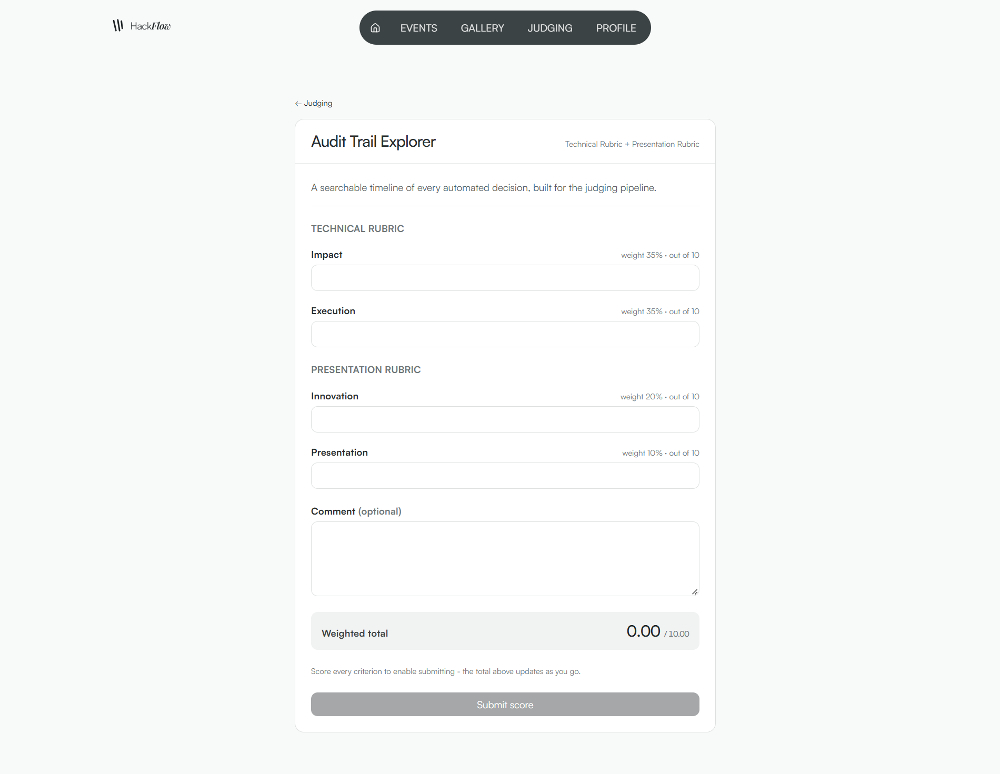

The top of the form shows the project and the team's links (code, demo, video). Below it,
the form is built from the scorecard the organizer wrote. Each item shows:

- **its weight**: how much it counts toward the total, and
- **what it is out of**: usually 10.

An event can use more than one scorecard (here, a *Technical Rubric* and a *Presentation
Rubric*), and they are combined into this single form. The **Weighted total** updates as you
type, so you do not need to do any arithmetic.

You can leave a comment with your score, and you can come back and change a score you have
already given.

**If you know the team**, choose **I have a conflict of interest with this project** at the
bottom. The project goes to another judge, will not be assigned to you again, and the
organizer sees your note.

### Three things worth knowing

**You are scoring alone, on purpose.** You cannot see any other judge's scores or comments,
and they cannot see yours. This is enforced by the server, not merely hidden on screen.

**You are never given a project from your own team.** The assignment step checks this
automatically.

**Being a tough marker will not hurt anyone.** After scoring finishes, HackFlow compares each
judge against their own average and adjusts for it. A consistently strict judge does not drag
their projects down the rankings, and a generous one does not lift theirs up. So score the
way that feels honest to you. You do not need to guess what the other judges are doing.

*(If you want the mathematics behind that, it is written up in `JUDGING.md`.)*

---

## 7. For organizers: running the event

### Step 1: Create the event

Choose **Create event**.

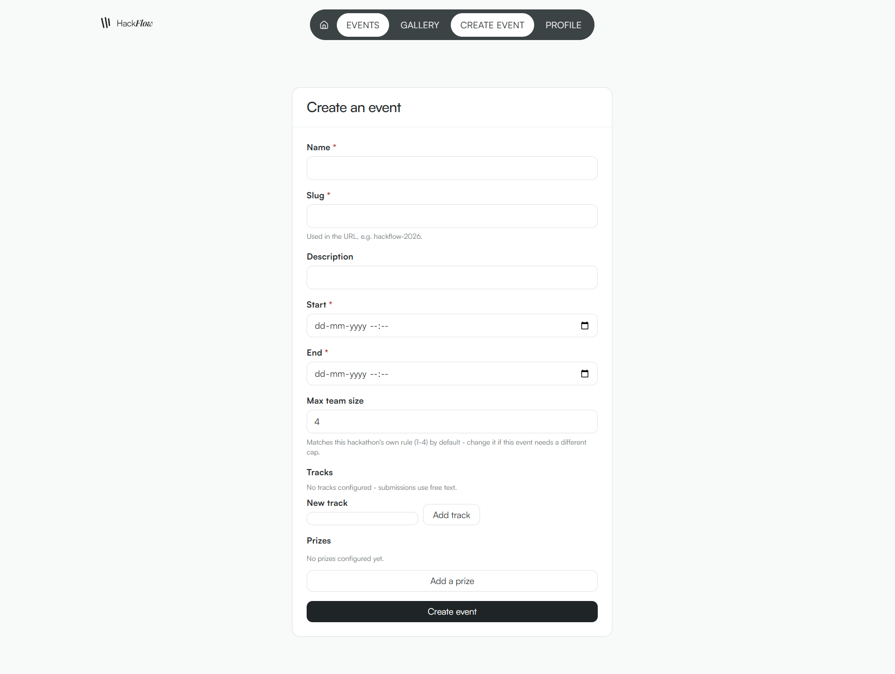

You give it a name, a web address slug, a description, start and end dates, the themes teams
may enter under, the prizes, and the largest team you will allow. Only the name, slug, and
dates are required. Everything else can be added later.

**New events start as drafts**, visible only to organizers, so you can set everything up
before anyone sees it. (To restore an event from a backup file instead, use **Import an
event** on the **Events** page.)

### Step 2: Settings, and going live

From the event page, choose **Event settings**.

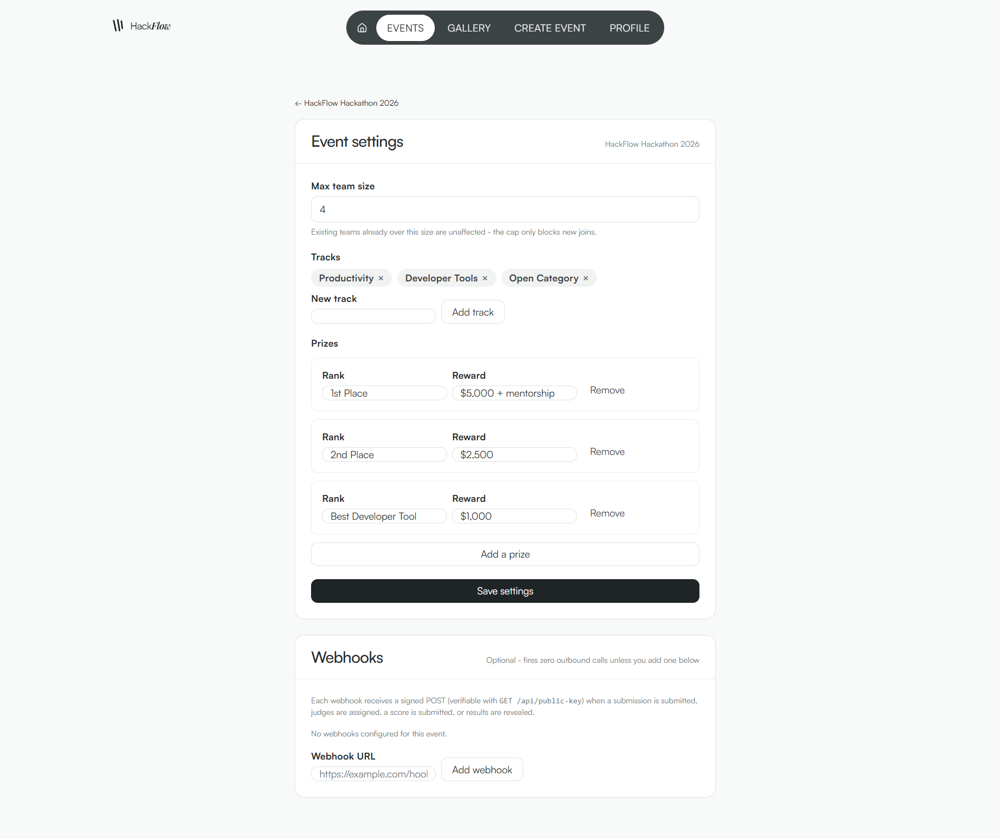

- **Visibility**: **Publish event** makes it visible so participants can find and join it.
  **Move back to draft** hides it again.
- **Dates**: move the start or the submission deadline. **Close submissions now** ends the
  submission window immediately, which is also what opens judging.
- **Rules**: plain text shown on the event page.
- Further down: the maximum team size, tracks, the prize list, and a downloadable backup of
  the whole event.

Raising or lowering the team-size limit only affects **new** joins. A team that is already
larger than a reduced limit is left alone rather than having someone thrown out.

### Step 3: Write the scorecard

From the event page, choose **Judging rubric**.

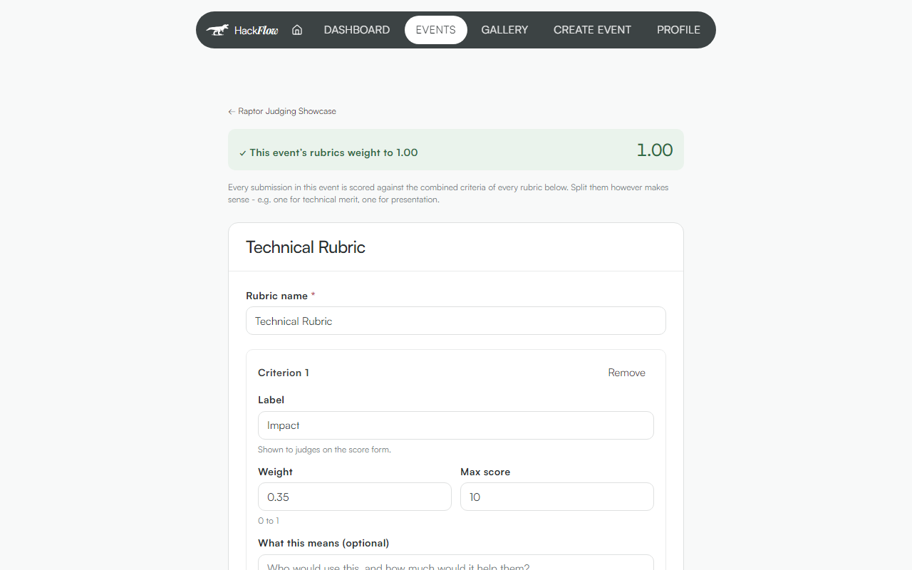

A scorecard is a list of things judges mark on, each with a weight, a maximum and an
optional description. The weights must add up to 100%, and the page tells you live whether
they do, so you cannot save something that does not add up.

You can create more than one scorecard for an event (for example *Technical* and
*Presentation*), and judges get them combined into one form.

**Scorecards lock once scoring starts.** As soon as the first judge submits a score, the
scorecard can no longer be edited. This guarantees every project in the event was measured
against the same thing.

### Step 4: Tell everyone something

The **Announcements** card on the event page is how you reach participants once the event is
running: a moved deadline, a demo schedule, a room change.

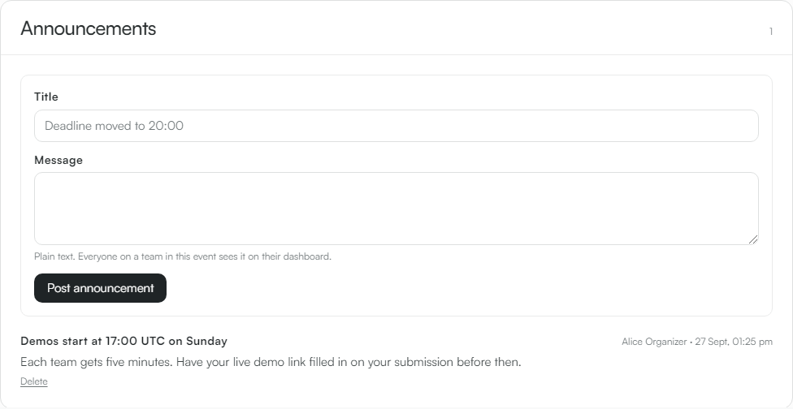

Write a title and a message and choose **Post announcement**. It appears on the event page
and on the dashboard of everyone on a team in the event, and **Delete** takes it down again.
It is plain text. If email is set up you can also email it to participants, and if the event
has a notification address (see *Optional* below) it is posted there too, which is handy for a
Discord or Slack channel.

### Step 5: Judges and the work

From the event page, choose **Assignments & results**.

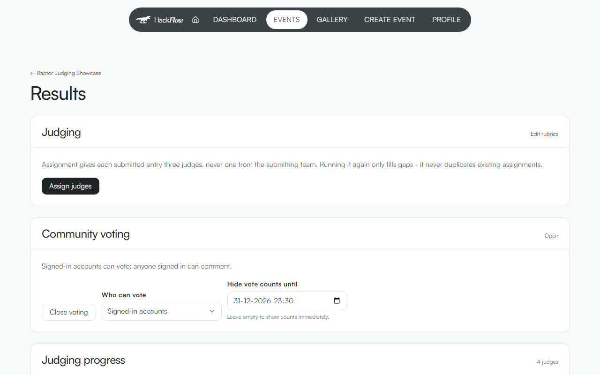

**To bring in judges**, use the *Judges* card further down: fill in the small form and
choose **Create invitation**. You get a link to send them. You can set how long it stays
valid and note who it was for.

**To hand out the judging**, choose **Assign judges**. HackFlow gives each submitted project
three judges from this event's panel, spreads the work evenly, and never gives anyone a
project from their own team or one they declared a conflict with. Running it again only
fills gaps. It will not duplicate work anyone already has. Assignment opens once
submissions close.

**Judging progress** shows who has scored what:

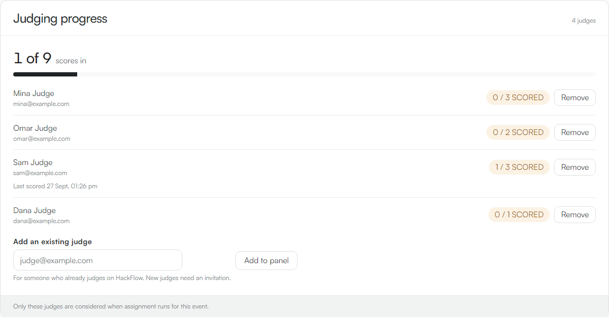

- Each judge's **scored / assigned** count, and when they last scored.
- **Remove** takes someone who dropped out off the panel; their unscored projects go back
  into the pool for the next **Assign judges** run.
- **Add an existing judge** puts someone who already judges on HackFlow onto this event's
  panel. New judges need an invitation.
- If email is set up, **Remind** nudges a judge who is behind.

### Step 6: Voting and results

The same screen controls the public side:

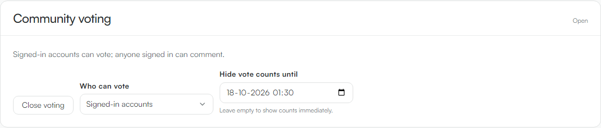

- **Open voting** or **Close voting** at any time.
- **Who can vote**:
  - *Signed-in accounts* (the default): anyone with a HackFlow account.
  - *Anyone who confirms an email*: guests enter an address and get a link; one vote per
    project per address, whether they vote as a guest or signed in. Needs email set up.
  - *Anyone with the link*: no sign-up at all. The easiest for a big public audience, and
    the easiest to game: someone determined can vote more than once from different
    networks. Keep the community prize small if you use it.
- **Hide vote counts until** sets the moment results become public. Until then, nobody
  outside the organizing team can see counts or standings.
- **Exports** gives you a spreadsheet of participants, projects, assignments, raw scores, or
  final normalized standings, at any point during the event.

### Step 7: Pick the winners

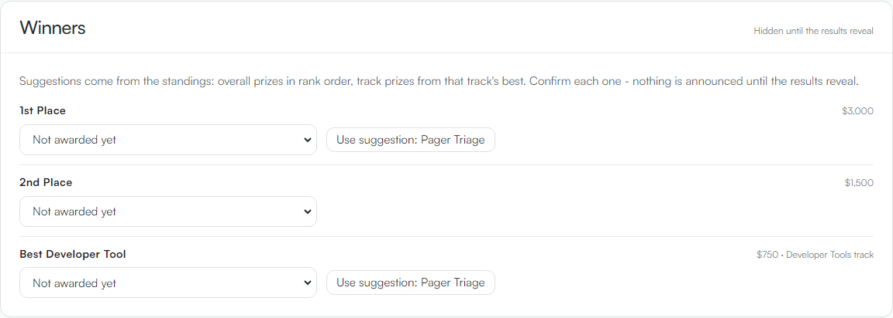

Each prize comes with a **suggestion** from the standings: overall prizes in rank order, a
track prize from that track's best entry. Choose **Use suggestion** or pick another project.
Nobody sees the winners until your results reveal time.

### Stages: the rounds of your event

**Event settings → Stages** lists your event's rounds, like Unstop's: a name, an optional
description, and start and end times for each, up to ten. **Add stage** starts the new one
where the last one ended, so the common case is one edit. **Save stages** puts them on the
event page as a numbered timeline, with the current stage highlighted.

Stages inform; they don't enforce. When submissions close is still decided by the event's
own dates above them.

### Certificate design

**Event settings → Certificate design** shows eight looks as real sample certificates:
Classic, Classic gold, Midnight tech, Modern gradient, Emerald prestige, Minimal mono, Royal
blue and Retro pixel. Click one and it is saved; every team's certificate uses it from then on,
even ones downloaded after results are out. The text, serial and verification link are the same
in every design.

### Helping someone sign in

When a participant or judge is locked out and the email reset isn't working for them, use
**Dashboard → Help someone sign in**:

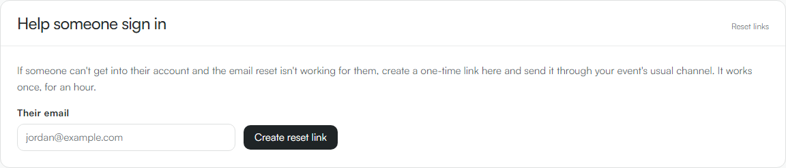

Type their email, choose **Create reset link**, then **Copy link**, and send it to them
directly. The link is shown only once, works once, and expires after an hour. Organizers can
reset participants and judges; resetting another organizer takes an admin. Every link is
recorded with your name on it.

### Integrations: API keys and webhooks

HackFlow connects to other software in two directions:

- **API keys** let other software *call into* HackFlow: a Discord bot that posts new
  submissions, a spreadsheet that pulls results, your own scripts.
- **Webhooks** let HackFlow *call out* to other software the moment something happens.

A companion app, **[Raptor Relay](https://github.com/sarvan-2187/hackflow-third-party)**,
uses both. It was built to show integration from the outside, the way any third party would
do it. The walkthrough further down sets it up in about five minutes.

#### Create an API key

1. Open **Integrations** in the sidebar (organizers and admins only).
2. Give the key a name that says what uses it ("Discord bot") and choose **Create key**.
3. **Copy** the key now. It starts with `hf_`, and it is shown once and never again.
   HackFlow keeps only a scrambled fingerprint of it, so nobody can look it up later,
   including you.
4. Give it to the tool, which sends it with every request as a header:
   `Authorization: Bearer hf_...`.

What a key can and can't do:

- **Exactly what you can do, nothing more.** A key acts as the organizer who made it,
  through the same permission checks as the web app. An organizer's key can't read a
  judge's private screens, and no key can submit a score.
- **One key per tool.** Then you can **Revoke** one without breaking the others. The list
  shows when each key was last used, so a key nobody uses is easy to spot and remove.
- **Revoking works immediately**, and so does deactivating the owner or removing their
  organizer role. You can have up to 20 live keys.
- **Keys are rate-limited**: 1,200 requests a minute per key by default, with the minute's
  budget usable as a burst. A tool that goes over gets `429 Too Many Requests` and a
  `Retry-After` header telling it how many seconds to wait.

The full list of endpoints, with a "try it out" button for each, is at **`/docs`** on your
HackFlow (linked from the Integrations page as **Interactive API reference**). A few useful
ones:

| What | Call |
|---|---|
| Who is this key? | `GET /api/auth/me` |
| Events | `GET /api/events` |
| Public gallery | `GET /api/gallery?event_id=10` |
| Normalized standings | `GET /api/events/10/results` |
| Raw scores as CSV | `GET /api/events/10/export/scores.csv` |
| Post an announcement | `POST /api/events/10/announcements` with `{"title": "...", "body": "..."}` |
| Whole event as JSON | `GET /api/events/10/export.json` |

```bash
curl -H "Authorization: Bearer hf_your_key" https://your-hackflow.example/api/events/10/results
```

#### Add a webhook

1. Open the event, then **Event settings → Webhooks**.
2. Paste the address that should be notified (it must start with `http://` or `https://`) and
   choose **Add webhook**.
3. Choose **Send test**. HackFlow sends a signed `webhook.test` notification right away. The
   badge next to the address then shows **delivered**, **failed** (the address didn't answer
   with success) or **blocked** (see below).

From then on, every action in the event is sent to that address as it happens:
submissions, team changes, judge assignments, scores, votes, comments, announcements,
settings changes and results going live. Each notification's **topic** is the action's
name, for example `submission.submitted`, `score.submitted`, `event.updated`,
`announcement.posted` or `event.results_revealed`.

Notifications carry ids and the action's name only, never scores, emails or vote details. A
tool that wants more fetches it through the API with a key. An event can have up to 10
webhooks, and removing one stops deliveries at once. With none, HackFlow never contacts
anything outside itself.

**Blocked addresses.** HackFlow refuses to send webhooks to private or internal addresses
(`localhost`, `127.0.0.1`, `10.x`, `192.168.x`, cloud metadata addresses and the like). That
stops anyone with an organizer login from using webhooks to probe the server's own network.
For a **local demo** where the receiving app runs on the same machine, put
`WEBHOOK_ALLOW_PRIVATE=1` in `.env` and restart. Don't set it on a public server.

#### For developers: checking a webhook is genuine

Each notification is a `POST` with a JSON body:

```json
{
  "record": {
    "topic": "announcement.posted",
    "event_id": 10,
    "issued_at": "2026-09-29T08:28:21.802770+00:00",
    "delivery_id": "0193c61c9e2f4f7b8a1d2c3b4a5f6e7d",
    "announcement_id": 1
  },
  "signature": "<base64 Ed25519 signature>",
  "public_key": "<base64 public key>",
  "algorithm": "ed25519"
}
```

It also has the headers `X-HackFlow-Topic`, `X-HackFlow-Delivery` and
`User-Agent: HackFlow-Webhooks/1.0`. To accept a notification, the receiver should:

1. **Fetch HackFlow's public key once** from `GET /api/public-key`, over https, and keep it.
   **Never** verify against the `public_key` inside the notification: anyone forging one
   would put their own key there.
2. **Verify the signature** over the *canonical JSON* of `record`: keys sorted, no spaces,
   non-ASCII characters escaped as `\uXXXX`. In Python that is
   `json.dumps(record, sort_keys=True, separators=(",", ":")).encode()`.
3. **Reject replays.** Drop anything whose `issued_at` is more than a few minutes old, or
   whose `delivery_id` has already been seen.
4. **Answer quickly with any 2xx.** HackFlow waits up to 5 seconds, tries once and never
   follows redirects. The result shows on the webhook's badge.

Python receiver, complete:

```python
import base64, json, urllib.request
from cryptography.hazmat.primitives.asymmetric.ed25519 import Ed25519PublicKey

KEY = base64.b64decode(json.load(urllib.request.urlopen("https://your-hackflow.example/api/public-key"))["public_key"])

def is_genuine(body: dict) -> bool:
    message = json.dumps(body["record"], sort_keys=True, separators=(",", ":")).encode()
    try:
        Ed25519PublicKey.from_public_bytes(KEY).verify(base64.b64decode(body["signature"]), message)
        return True
    except Exception:
        return False
```

A Node.js version is in Raptor Relay's
[`lib/hackflow.mjs`](https://github.com/sarvan-2187/hackflow-third-party/blob/main/lib/hackflow.mjs)
(`verifyDelivery`), with tests that include a forged notification and a replayed one.

#### Walkthrough: connect Raptor Relay to your HackFlow

Raptor Relay is a separate app. It shows a live feed of your event's verified webhooks, pulls
the gallery and the normalized standings over the API, and can post announcements, all
using one organizer API key.


1. **Start HackFlow with local webhooks allowed**, since the demo runs on your machine:

   ```bash
   echo "WEBHOOK_ALLOW_PRIVATE=1" > .env
   docker compose up --build
   ```

2. **Create a key.** Sign in as the organizer (`alice@example.com` / `organizer-pass1`),
   open **Integrations**, create a key named "Raptor Relay" and copy it.

3. **Start Raptor Relay** (Node.js 20.10 or newer, nothing to install):

   ```bash
   git clone https://github.com/sarvan-2187/hackflow-third-party.git
   cd hackflow-third-party
   cp .env.example .env      # paste the key into HACKFLOW_API_KEY
   npm start                 # opens on http://localhost:4000
   ```

   `.env.example` already sets `PUBLIC_URL=http://host.docker.internal:4000`, which is how
   HackFlow, running inside Docker, reaches an app on your computer.

4. **Connect.** On Raptor Relay's page, pick an event and press **Register webhook + test
   ping**. Raptor Relay adds its own webhook through the API, and a verified `webhook.test`
   appears in its feed. You will also see the new webhook under **Event settings →
   Webhooks** in HackFlow.

5. **Try it.** Change something in HackFlow, for example edit the event's rules or post an
   announcement, and watch it arrive in Raptor Relay's feed. Press **Pull gallery +
   results** to read the standings over the API, or **Post** to send an announcement from
   Raptor Relay into HackFlow.

To see a forged notification refused, send one by hand:

```bash
curl -X POST http://localhost:4000/webhooks/hackflow -H "Content-Type: application/json" \
  -d '{"record":{"topic":"event.results_revealed","event_id":10,"issued_at":"2026-09-29T08:30:00+00:00"},"signature":"AAAA","algorithm":"ed25519"}'
# {"error":"bad signature"}, and the "Rejected" counter on the page goes up
```

---

## 8. For admins: running the site

Admins get everything organizers have, plus a **Users** tab.

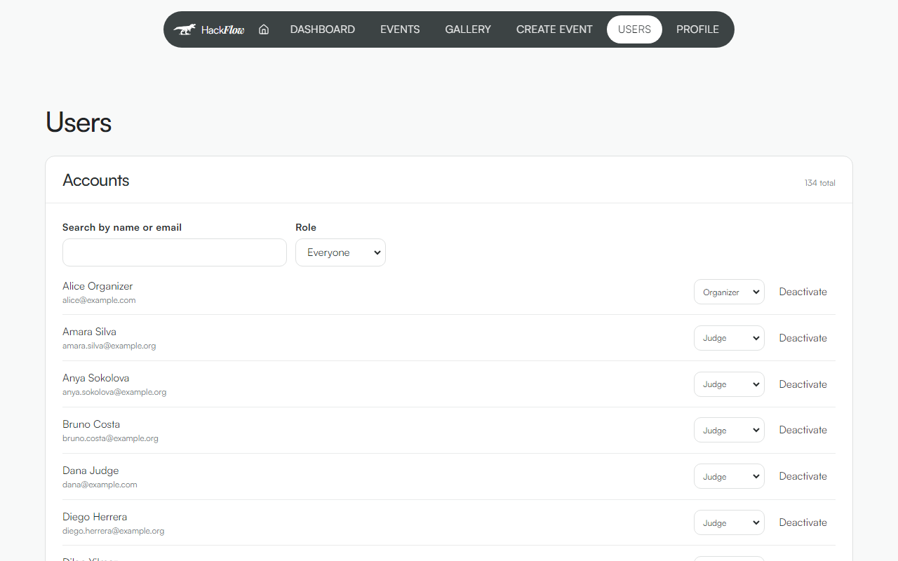

- **Search** by name or email, or filter by role.
- **Change a role** from the drop-down on any account, for example to make an existing
  participant an organizer.
- **Deactivate** an account to sign it out everywhere and stop it logging in, without
  deleting anything it wrote. **Reactivate** undoes it.
- **Invite an organizer** creates a single-use link for someone who does not have an account
  yet.

The admin **Dashboard** also has an **Email delivery** card. Email is optional and off by
default (see the README's "Email (optional)" section). Once it is set up, press **Send test
email** to check it works before anyone needs a reset link.

---

## 9. Troubleshooting

**The page says my deadline has passed but I am not finished.**
Deadlines are enforced by the server and cannot be worked around from the browser. Ask your
organizer. They can move the event's end date from **Event settings**.

**My invite link does not work.**
The page will tell you why: the team is already full, the link has been replaced with a new
one, or you are already on that team (or on another team in the same hackathon; leave that
one first).

**I cannot see vote counts or rankings.**
That is intended until the organizer's reveal time. The numbers are genuinely withheld, not
just hidden from view, so refreshing or trying another browser will not reveal them early.

**I cannot vote.**
Check the event's voting is open. If the page says *Log in to vote*, this event only lets
accounts vote. If it says *Confirm your email to vote*, use the **Vote without an account**
box and open the emailed link in the same browser.

**I am a judge but I cannot see a project I want to score.**
You can only score what you were assigned. If you believe something is missing, ask the
organizer to re-run assignment.

**I'm a judge and my list is empty.**
Judging opens once an event's submissions close. The **Coming up** card on your Judging page
says when that is for each of your events.

**The scorecard will not save.**
The weights must total exactly 100%. The page shows the running total as you type. If it is
locked instead, scoring has already begun and it can no longer be changed.

**My new event doesn't show up for participants.**
New events start as drafts. Open **Event settings → Publish event**.

**Email-confirmed voting can't be selected.**
It needs email set up first; otherwise guests could never receive their link.

**I'm the admin, and I'm locked out.**
Anyone with access to the server can run:

```bash
docker compose exec api python -m app.auth.reset_link you@example.com
```

It prints a one-time reset link for that account. On Render, run
`python -m app.auth.reset_link you@example.com` from the service's **Shell** tab instead
(the Shell tab needs a paid plan).

**I want to start over with clean sample data.**
Stop the site and run:

```bash
docker compose down -v
docker compose up
```

This erases everything and re-creates the original sample data. Do not run it on a real
event, because it deletes real entries too.

---

## Where to go next

This manual covers using HackFlow. If you want to understand or modify how it works:

- **`README.md`**: what it is and how to run it
- **`ARCHITECTURE.md`**: how the system is put together
- **`DATA-MODEL.md`**: what is stored, and how to get data in and out
- **`JUDGING.md`**: the assignment algorithm and the normalization mathematics
- **`THREAT-MODEL.md`**: the abuse scenarios it defends against, and how
